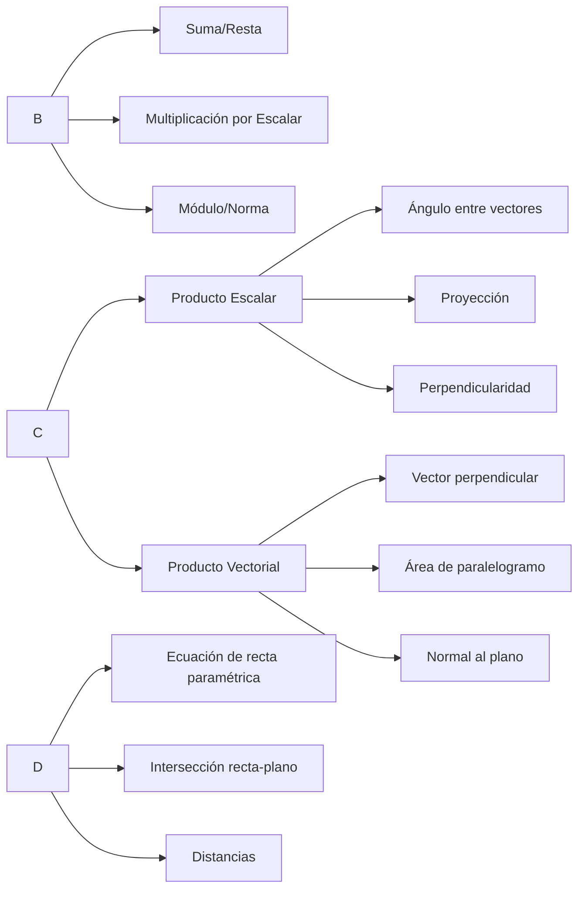
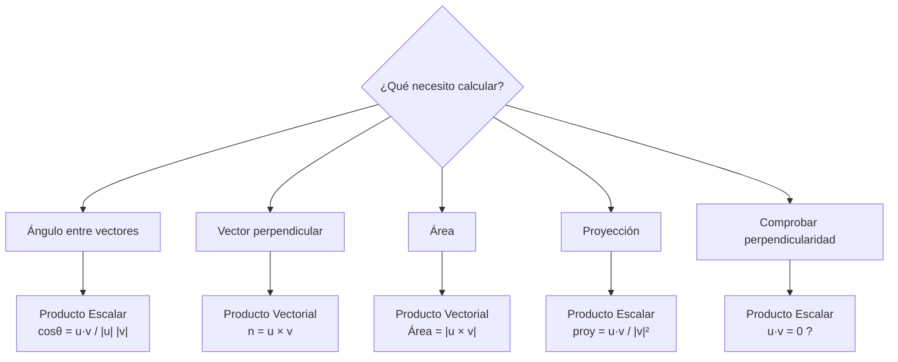
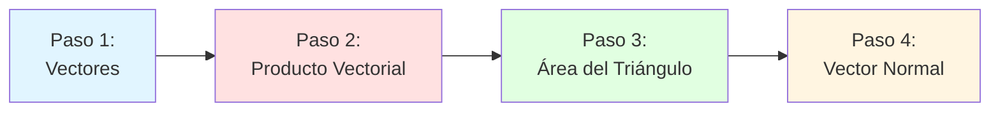

# Resumen Visual — UD1: Fundamentos de Vectores

## 🎯 Objetivo de la Unidad

Dominar las operaciones básicas con vectores en $\mathbb{R}^3$: suma, resta, productos (escalar y vectorial), y aplicaciones geométricas fundamentales.

---

## 📊 Mapa Conceptual

---

## 📐 Fórmulas Clave

### Operaciones Básicas

| Operación   | Fórmula                                                       | Ejemplo                       |
| ----------- | ------------------------------------------------------------- | ----------------------------- | -------------------------------- | --- | --------- | -------------------- |
| **Suma**    | $(a_1,a_2,a_3) + (b_1,b_2,b_3) = (a_1+b_1, a_2+b_2, a_3+b_3)$ | $(1,2,3) + (4,5,6) = (5,7,9)$ |
| **Resta**   | $(a_1,a_2,a_3) - (b_1,b_2,b_3) = (a_1-b_1, a_2-b_2, a_3-b_3)$ | $(4,5,6) - (1,2,3) = (3,3,3)$ |
| **Escalar** | $k(a_1,a_2,a_3) = (ka_1, ka_2, ka_3)$                         | $2(1,2,3) = (2,4,6)$          |
| **Módulo**  | $\\                                                           | \\mathbf{v}\\                 | = \\sqrt{v_1^2 + v_2^2 + v_3^2}$ | $\\ | (1,2,2)\\ | = \\sqrt{1+4+4} = 3$ |

### Producto Escalar

$$
\mathbf{u} \cdot \mathbf{v} = u_1v_1 + u_2v_2 + u_3v_3 = \\|\mathbf{u}\\| \\|\mathbf{v}\\| \cos\theta
$$

**Propiedades clave:**

- Si $\mathbf{u} \cdot \mathbf{v} = 0$ → vectores perpendiculares
- $\cos\theta = \frac{\mathbf{u} \cdot \mathbf{v}}{\\|\mathbf{u}\\| \\|\mathbf{v}\\|}$

### Producto Vectorial

$$
\mathbf{u} \times \mathbf{v} =
\begin{vmatrix}
\mathbf{i} & \mathbf{j} & \mathbf{k} \\
u_1 & u_2 & u_3 \\
v_1 & v_2 & v_3
\end{vmatrix}
$$

**Propiedades clave:**

- $\mathbf{u} \times \mathbf{v}$ es perpendicular a ambos vectores
- $\\|\mathbf{u} \times \mathbf{v}\\|$ = área del paralelogramo formado por $\mathbf{u}$ y $\mathbf{v}$
- Área del triángulo = $\frac{1}{2}\\|\mathbf{u} \times \mathbf{v}\\|$

---

## 🔄 Árbol de Decisión: ¿Qué Producto Usar?

---

## ✅ Checklist de Verificación

### Al resolver ejercicios con vectores:

- [ ] ¿Las coordenadas están en el orden correcto $(x, y, z)$?
- [ ] ¿He verificado las unidades y el contexto del problema?
- [ ] ¿El resultado del producto vectorial es perpendicular a ambos vectores originales?
- [ ] ¿El módulo calculado tiene sentido geométrico?
- [ ] ¿He comprobado casos especiales (vectores paralelos, perpendiculares)?

---

## 🎓 Aplicaciones Geométricas

### Recta Paramétrica

$$
\mathbf{r}(t) = \mathbf{p} + t\mathbf{d}
$$

- $\mathbf{p}$: punto de la recta
- $\mathbf{d}$: vector dirección
- $t \in \mathbb{R}$: parámetro

### Intersección Recta-Plano

Para plano $z = c$ y recta $\mathbf{r}(t) = (p_x + td_x, p_y + td_y, p_z + td_z)$:

1. Igualar componente $z$: $p_z + td_z = c$
2. Resolver para $t$: $t = \frac{c - p_z}{d_z}$
3. Sustituir $t$ en la ecuación de la recta

---

## 🧮 Ejemplo Integrador

**Problema:** Dados tres puntos $A(1,0,0)$, $B(2,1,1)$, $C(0,2,1)$:

1. **Vectores:** $\overrightarrow{AB} = (1,1,1)$, $\overrightarrow{AC} = (-1,2,1)$
2. **Producto vectorial:** $\overrightarrow{AB} \times \overrightarrow{AC} = (-1,-2,3)$
3. **Área triángulo:** $\frac{\sqrt{14}}{2}$ unidades²
4. **Vector normal:** $(-1,-2,3)$

---

## 📚 Dependencias Lineales

### Combinación Lineal

Un vector $\mathbf{w}$ es combinación lineal de $\mathbf{u}$ y $\mathbf{v}$ si:

$$
\mathbf{w} = \alpha\mathbf{u} + \beta\mathbf{v}
$$

para algunos escalares $\alpha, \beta \in \mathbb{R}$.

### Independencia Lineal

Vectores $\mathbf{v}_1, \mathbf{v}_2, \mathbf{v}_3$ son **linealmente independientes** si:

$$
\alpha_1\mathbf{v}_1 + \alpha_2\mathbf{v}_2 + \alpha_3\mathbf{v}_3 = \mathbf{0} \implies \alpha_1 = \alpha_2 = \alpha_3 = 0
$$

---

## 💡 Errores Comunes

!!! warning "⚠️ Cuidado con estos errores"

    - **Producto vectorial NO es conmutativo**: $\mathbf{u} \times \mathbf{v} = -(\mathbf{v} \times \mathbf{u})$
    - **El producto escalar da un escalar**, no un vector
    - **El módulo siempre es ≥ 0**
    - **Confundir ángulo entre vectores con ángulo en el plano**
    - **Olvidar normalizar cuando se pide vector unitario**

---

## 🔗 Enlaces Relacionados

- [Ejercicios UD1](ejercicios.md)
- [Temario completo UD1](temario.md)
- [UD2: Espacios Vectoriales](../ud2/index.md)
