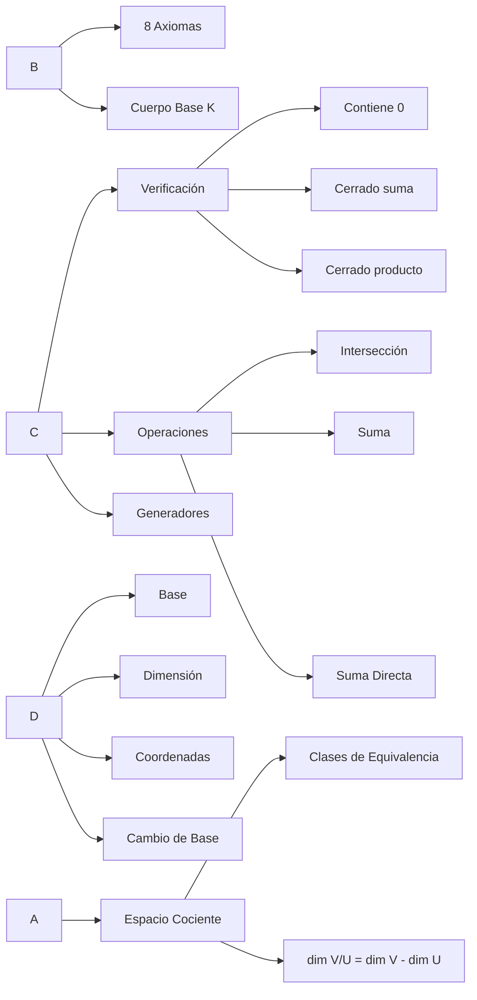
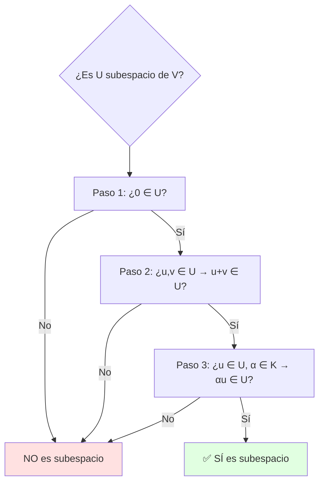
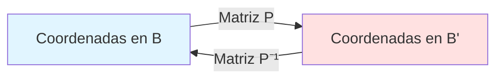
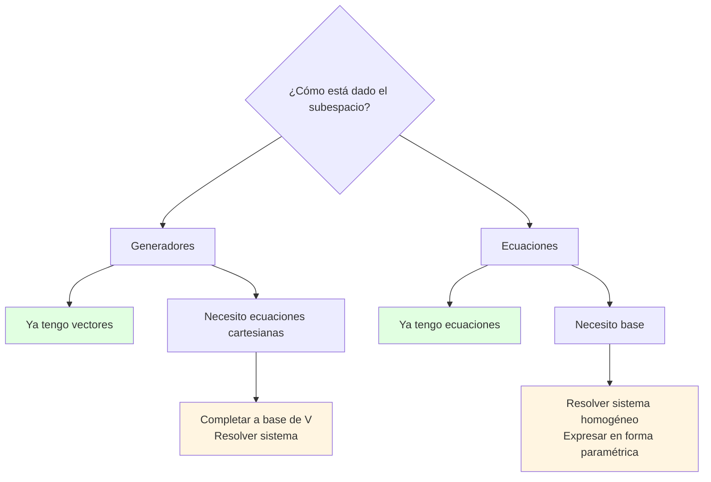

# Resumen Visual — UD2: Espacios Vectoriales y Subespacios

## 🎯 Objetivo de la Unidad

Comprender la estructura de los espacios vectoriales, bases, dimensión, subespacios y sus operaciones, así como cambios de base y espacios cociente.

---

## 📊 Mapa Conceptual

---

## 📐 Conceptos Fundamentales

### Espacio Vectorial

Un conjunto $V$ con operaciones $+$ y $\cdot$ es un **espacio vectorial** sobre $\mathbb{K}$ si cumple 8 axiomas:

| Axioma | Propiedad              | Ejemplo en $\mathbb{R}^n$              |
| ------ | ---------------------- | -------------------------------------- |
| A1     | Asociatividad suma     | $(u+v)+w = u+(v+w)$                    |
| A2     | Conmutatividad suma    | $u+v = v+u$                            |
| A3     | Elemento neutro        | $\exists 0: v+0=v$                     |
| A4     | Inverso aditivo        | $\exists -v: v+(-v)=0$                 |
| M1     | Asociatividad producto | $\alpha(\beta v) = (\alpha\beta)v$     |
| M2     | Elemento neutro        | $1 \cdot v = v$                        |
| D1     | Distributiva 1         | $\alpha(u+v) = \alpha u + \alpha v$    |
| D2     | Distributiva 2         | $(\alpha+\beta)v = \alpha v + \beta v$ |

---

## 🔍 Verificación de Subespacios

### Método Alternativo (Combinación Lineal)

**U es subespacio** ⟺ $\forall u,v \in U, \forall \alpha,\beta \in \mathbb{K}: \alpha u + \beta v \in U$

---

## 🔄 Operaciones con Subespacios

### Intersección

$$
U \cap W = \{v \in V : v \in U \text{ y } v \in W\}
$$

**Método:** Resolver sistema de ecuaciones cartesianas simultáneas.

### Suma

$$
U + W = \{u + w : u \in U, w \in W\}
$$

**Método:** Base de $U+W$ = base obtenida de vectores generadores de $U$ y $W$ (reducir y extraer linealmente independientes).

### Suma Directa

$$
V = U \oplus W \iff \begin{cases}
V = U + W \\
U \cap W = \{0\}
\end{cases}
$$

!!! tip "✨ Fórmula de las Dimensiones"

    $$
    \dim(U + W) = \dim(U) + \dim(W) - \dim(U \cap W)
    $$

---

## 📏 Bases y Dimensión

### Base

Un conjunto $B = \{\mathbf{v}_1, \ldots, \mathbf{v}_n\}$ es **base** de $V$ si:

1. $B$ es linealmente independiente
2. $B$ genera $V$: todo vector de $V$ se expresa como combinación lineal de $B$

### Dimensión

$$
\dim(V) = \text{número de vectores en cualquier base de } V
$$

**Propiedades:**

- Todo espacio vectorial tiene infinitas bases
- Todas las bases tienen el mismo número de elementos
- $\dim(\mathbb{R}^n) = n$

---

## 🔀 Cambio de Base

### Matriz de Cambio de Base

$$
P_{B \to B'} = \begin{pmatrix}
| & | & & | \\
[\mathbf{v}_1]_{B'} & [\mathbf{v}_2]_{B'} & \cdots & [\mathbf{v}_n]_{B'} \\
| & | & & |
\end{pmatrix}
$$

donde $B = \{\mathbf{v}_1, \ldots, \mathbf{v}_n\}$

**Fórmula:**

$$
[\mathbf{v}]_{B'} = P_{B \to B'} [\mathbf{v}]_B
$$

---

## 🎭 Espacio Cociente

### Definición

Dado subespacio $U \subseteq V$, el **espacio cociente** es:

$$
V/U = \{v + U : v \in V\}
$$

donde $v + U = \{v + u : u \in U\}$ es la **clase de equivalencia**.

### Relación de Equivalencia

$$
v \sim w \iff v - w \in U
$$

### Dimensión

$$
\dim(V/U) = \dim(V) - \dim(U)
$$

---

## 🌳 Árbol de Decisión: Representación de Subespacios

---

## 📊 Tabla Resumen: Tipos de Subespacios en $\mathbb{R}^3$

| dim(U) | Nombre              | Ejemplo        | Ecuaciones                |
| ------ | ------------------- | -------------- | ------------------------- |
| 0      | Origen              | $\{(0,0,0)\}$  | $x=0, y=0, z=0$           |
| 1      | Recta               | $L\{(1,0,1)\}$ | $x=z, y=0$ (2 ecuaciones) |
| 2      | Plano               | $x+y+z=0$      | 1 ecuación                |
| 3      | Todo $\mathbb{R}^3$ | $\mathbb{R}^3$ | sin restricciones         |

---

## ✅ Checklist de Ejercicios

### Para verificar si U es subespacio:

- [ ] ¿El vector nulo pertenece a U?
- [ ] ¿Dados dos vectores cualesquiera su suma está en U?
- [ ] ¿Multiplicar por escalar mantiene el vector en U?

### Para hallar intersección:

- [ ] ¿He planteado el sistema con todas las ecuaciones?
- [ ] ¿He resuelto correctamente por Gauss?
- [ ] ¿He expresado la solución en forma paramétrica?

### Para hallar suma:

- [ ] ¿He juntado los generadores de ambos subespacios?
- [ ] ¿He eliminado vectores redundantes (dependientes)?
- [ ] ¿He verificado la dimensión con la fórmula?

---

## 💡 Errores Comunes

!!! warning "⚠️ Cuidado"

    - **No todo subconjunto es subespacio**: debe cumplir las 3 condiciones
    - **Recta que no pasa por el origen NO es subespacio**
    - **dim(U ∩ W) ≠ 0 en general**: solo si U y W son complementarios
    - **Cambio de base**: confundir $P$ con $P^{-1}$
    - **Espacio cociente**: olvidar que dim(V/U) + dim(U) = dim(V)

---

## 🔗 Enlaces Relacionados

- [Ejercicios UD2](ejercicios.md)
- [Coordenadas y Cambio de Base](coordenadas-cambio-de-base.md)
- [Espacio Cociente](espacio-cociente.md)
- [UD3: Aplicaciones Lineales](../ud3/index.md)
