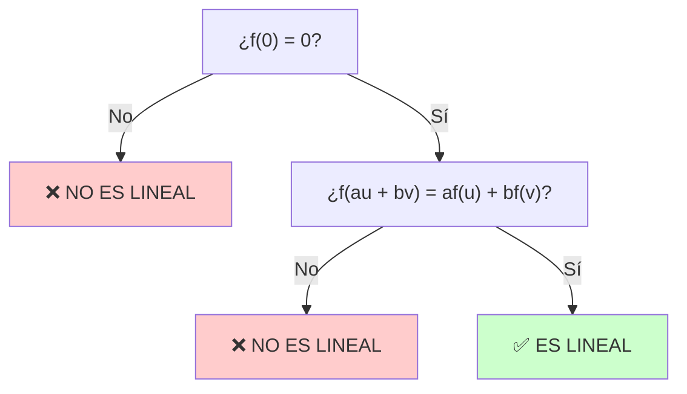

# Aplicaciones Lineales

En esta página ampliamos el concepto de aplicación (o transformación) lineal, presentamos criterios prácticos para verificar la linealidad y varios ejemplos con explicaciones paso a paso.

## Definición

Una aplicación lineal es una función $f: V \to V'$ entre espacios vectoriales sobre el mismo cuerpo $K$ que conserva la suma y el producto por escalares.

Equivalente a la forma combinada, solemos usar las dos propiedades separadas (más fáciles de recordar y comprobar):

- Aditividad: $f(\mathbf{u}+\mathbf{v}) = f(\mathbf{u}) + f(\mathbf{v}),\qquad \forall\;\mathbf{u},\mathbf{v}\in V.$
- Homogeneidad (compatibilidad con escalares): $f(a\mathbf{u}) = a\, f(\mathbf{u}),\qquad \forall\;a\in K,\;\mathbf{u}\in V.$

Estas dos propiedades juntas son equivalentes a la condición combinada
$f(a\mathbf{u} + b\mathbf{v}) = a f(\mathbf{u}) + b f(\mathbf{v}),\qquad \forall\;a,b\in K,\;\mathbf{u},\mathbf{v}\in V.$

### Propiedades rápidas

- Siempre se cumple: $f(\mathbf{0}_V)=\mathbf{0}_{V'}$ (filtro rápido para descartar linealidad).
- Para verificar la linealidad basta comprobar la aditividad y la homogeneidad sobre una base o generadores del dominio.

## Cómo comprobar si una aplicación es lineal

### Árbol de Decisión

### Procedimiento Paso a Paso

1. **Filtro rápido:** Comprobar que $f(\mathbf{0}) = \mathbf{0}$

   - Si falla → **no es lineal** ✗
   - Si cumple → continuar

2. **Verificar linealidad:** Comprobar $f(\alpha\mathbf{u}+\beta\mathbf{v})=\alpha f(\mathbf{u})+\beta f(\mathbf{v})$ para vectores genéricos o sobre una base

3. **Interpretación alternativa:** Verificar por separado
   - **Aditividad:** $f(\mathbf{u}+\mathbf{v}) = f(\mathbf{u}) + f(\mathbf{v})$
   - **Homogeneidad:** $f(a\mathbf{u}) = a f(\mathbf{u})$

---

## Ejemplos y ejercicios

### Ejercicio 1

Sea $f:\mathbb{R}^3\to\mathbb{R}^2,\quad f(x,y,z)=(x+y,\; y-z).$

Comprobar que $f$ es lineal.

???- example "Solución"

    Tomamos vectores $u=(x_1,y_1,z_1),\; v=(x_2,y_2,z_2)$ y escalares $\alpha,\beta$. Calculamos:

    $f(\alpha u+\beta v)=f(\alpha x_1+\beta x_2,\;\alpha y_1+\beta y_2,\;\alpha z_1+\beta z_2)=$
    $=(\alpha x_1+\beta x_2+\alpha y_1+\beta y_2,\;\alpha y_1+\beta y_2-\alpha z_1-\beta z_2)$
    $=\alpha(x_1+y_1,y_1-z_1)+\beta(x_2+y_2,y_2-z_2)=\alpha f(u)+\beta f(v).$

    Por tanto, $f$ es lineal.

### Ejercicio 2

Sea $$g:\mathbb{R}^2\to\mathbb{R}^2,\quad g(x,y)=(x+1,y).$$ Comprobar que no es lineal.

???- example "Solución"

    Observamos $g(0,0)=(1,0)\neq(0,0)$, luego no cumple la condición mínima $g(0)=0$ y por tanto no es lineal.

### Ejercicio 3

Decidir si la aplicación $h:\mathbb{R}^2\to\mathbb{R},\quad h(x,y)=3x-2y$ es lineal y justificar.

???- example "Solución"

    Es de la forma $h(x,y)=a x + b y$ con $a,b$ escalares; comprobamos linealidad por las propiedades de suma y multiplicación por escalares (es una forma lineal). Además $h(0,0)=0$.

### Ejercicio 4

Sea $p:\mathbb{R}_2[x]\to\mathbb{R},\quad p(q)=q(1)+q(0).$ ¿Es lineal?

???- example "Solución ampliada"
    
    Vamos a detallar la comprobación usando polinomios genéricos y mostrando tanto la aditividad como la homogeneidad.

    1) Notación: sea
    $$
    q_1(x)=a_0+a_1x+a_2x^2, \qquad q_2(x)=b_0+b_1x+b_2x^2
    $$
    (cualquier polinomio en $\mathbb{R}_2[x]$ puede escribirse así).

    2) Evaluación en puntos: por definición
    $p(q)=q(1)+q(0).$
    Calculamos primero las evaluaciones individuales:
    $q_1(1)=a_0+a_1+a_2,\quad q_1(0)=a_0,$
    $q_2(1)=b_0+b_1+b_2,\quad q_2(0)=b_0.$

    3)  Comprobación de aditividad (suma):

    $$
    \begin{align*}
    p(q_1+q_2)&=(q_1+q_2)(1)+(q_1+q_2)(0) \\
    &=\bigl(q_1(1)+q_2(1)\bigr)+\bigl(q_1(0)+q_2(0)\bigr) \\
    &=\bigl(q_1(1)+q_1(0)\bigr)+\bigl(q_2(1)+q_2(0)\bigr)=p(q_1)+p(q_2).
    \end{align*}
    $$

    4)  Comprobación de homogeneidad (multiplicación por un escalar $\alpha$):

    $$
    \begin{align*}
    p(\alpha q_1)&=(\alpha q_1)(1)+(\alpha q_1)(0) \\
    &=\alpha q_1(1)+\alpha q_1(0)=\alpha\bigl(q_1(1)+q_1(0)\bigr)=\alpha p(q_1).
    \end{align*}
    $$

    5)  Comprobación combinada (linealidad completa): para escalares $\alpha,\beta$ y polinomios $q_1,q_2$ se tiene:

    $$
    \begin{align*}
    p(\alpha q_1+\beta q_2)&=(\alpha q_1+\beta q_2)(1)+(\alpha q_1+\beta q_2)(0) \\
    &=\alpha q_1(1)+\beta q_2(1)+\alpha q_1(0)+\beta q_2(0) \\
    &=\alpha\bigl(q_1(1)+q_1(0)\bigr)+\beta\bigl(q_2(1)+q_2(0)\bigr) \\
    &=\alpha p(q_1)+\beta p(q_2).
    \end{align*}
    $$

    Con esto queda claro que $p$ es una aplicación lineal: anula el cero (porque $p(0)=0(1)+0(0)=0$), satisface la aditividad y la homogeneidad.

### Ejercicio 5

Construir una aplicación lineal $f:\mathbb{R}^2\to\mathbb{R}^2$ tal que $f(1,0)=(2,1)$ y $f(0,1)=(0,3)$ y expresar $f(x,y)$.

???- example "Solución"
    Como $f$ es lineal y la base canónica es $\{(1,0),(0,1)\}$, para un vector genérico $(x,y)$ se tiene

    $$
    (x,y)=x(1,0)+y(0,1).
    $$

    Por linealidad,
    $$
    f(x,y)=x\,f(1,0)+y\,f(0,1)=x(2,1)+y(0,3)=(2x,\;x+3y).
    $$

    La matriz de \(f\) en la base canónica tiene como columnas las imágenes de los vectores base:

    \[
    A=\begin{pmatrix}2 & 0 \\ 1 & 3\end{pmatrix},
    \]

    cuyas columnas son \(f(1,0)=(2,1)\) y \(f(0,1)=(0,3)\). Por tanto

    \[
    A\begin{pmatrix}x \\ y\end{pmatrix}=\begin{pmatrix}2x \\ x+3y\end{pmatrix}.
    \]

    Observaciones breves:
    - Se cumple $f(0,0)=(0,0)$.
    - La aplicación así definida es única por la linealidad y las imágenes dadas sobre la base.

## Resumen

| Término        | Fórmula/condición                                                              | Descripción breve                        |
| -------------- | ------------------------------------------------------------------------------ | ---------------------------------------- |
| Filtro rápido  | $f(\mathbf{0})=\mathbf{0}$                                                     | Condición necesaria (pero no suficiente) |
| Aditividad     | $f(\mathbf{u}+\mathbf{v})=f(\mathbf{u})+f(\mathbf{v})$                         | Conserva suma                            |
| Homogeneidad   | $f(a\mathbf{u})=a f(\mathbf{u})$                                               | Conserva producto por escalares          |
| **Linealidad** | $f(\alpha\mathbf{u}+\beta\mathbf{v})=\alpha f(\mathbf{u})+\beta f(\mathbf{v})$ | Combinación de ambas propiedades         |

---

## ✨ Características Adicionales

!!! tip "💡 Criterio de linealidad de formas lineales"

    Si $f(\mathbf{x}) = a_1x_1 + a_2x_2 + \cdots + a_nx_n$ (suma ponderada de coordenadas), entonces **siempre es lineal** y automáticamente $f(\mathbf{0})=\mathbf{0}$.

!!! warning "⚠️ Errores Comunes"

    - Verificar PRIMERO que $f(\mathbf{0})=\mathbf{0}$; si no cumple, se ahorra trabajo
    - No confundir "función lineal" (recta) en Cálculo con "aplicación lineal" (preserva estructura)
    - Una aplicación lineal $f(x) = cx$ en ℝ pasa por el origen necesariamente
    - Términos constantes como $f(x,y) = x+y+1$ **nunca son lineales**
