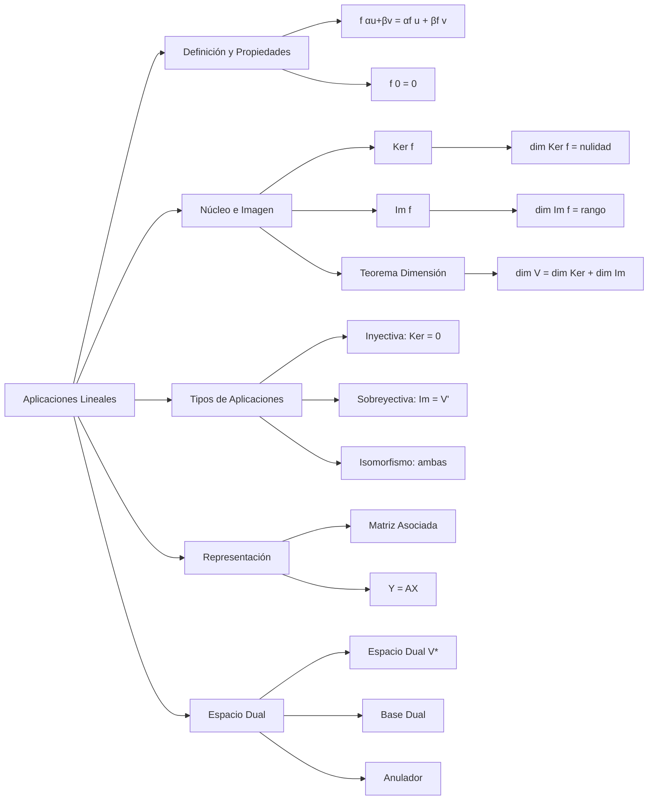
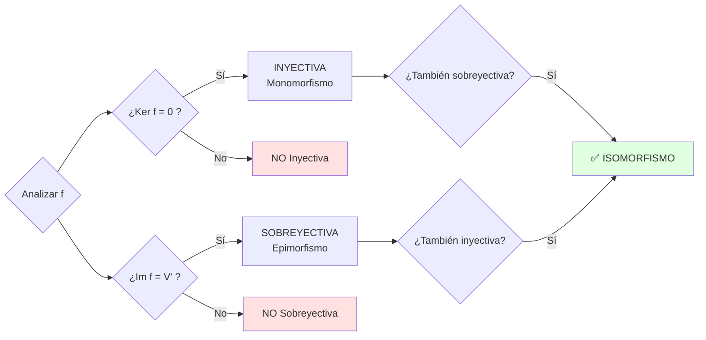
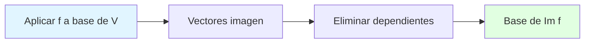

# Resumen Visual — UD3: Aplicaciones Lineales

## 🎯 Objetivo de la Unidad

Comprender las aplicaciones lineales entre espacios vectoriales, sus propiedades fundamentales (núcleo e imagen), representación matricial, isomorfismos y el concepto de espacio dual.

---

## 📊 Mapa Conceptual

---

## 📐 Conceptos Fundamentales

### Aplicación Lineal

Una función $f: V \to V'$ es **lineal** si conserva combinaciones lineales:

$$
f(a\mathbf{u} + b\mathbf{v}) = a f(\mathbf{u}) + b f(\mathbf{v})
$$

!!! tip "✨ Verificación rápida"

    Si $f(\mathbf{0}) \neq \mathbf{0}$, entonces $f$ NO es lineal.

---

## 🔍 Núcleo e Imagen

### Tabla Comparativa

| Concepto         | Definición                                            | Subespacio de  | Dimensión |
| ---------------- | ----------------------------------------------------- | -------------- | --------- |
| **Núcleo** (Ker) | $\\{\mathbf{x} \in V : f(\mathbf{x}) = \mathbf{0}\\}$ | Dominio $V$    | Nulidad   |
| **Imagen** (Im)  | $\\{f(\mathbf{x}) : \mathbf{x} \in V\\}$              | Codominio $V'$ | Rango     |

### Teorema de la Dimensión

$$
\dim(V) = \dim(\text{Ker}(f)) + \dim(\text{Im}(f))
$$

**Interpretación:** La dimensión del dominio se reparte entre vectores que "se pierden" (núcleo) y vectores que "se alcanzan" (imagen).

---

## 🔄 Árbol de Decisión: Tipos de Aplicaciones

---

## 📊 Clasificación de Aplicaciones Lineales

| Tipo             | Condición Núcleo                   | Condición Imagen    | Condición Matriz                | Nombre       |
| ---------------- | ---------------------------------- | ------------------- | ------------------------------- | ------------ |
| **Inyectiva**    | $\text{Ker}(f) = \\{\mathbf{0}\\}$ | -                   | $\text{rg}(A) = n$ (columnas)   | Monomorfismo |
| **Sobreyectiva** | -                                  | $\text{Im}(f) = V'$ | $\text{rg}(A) = m$ (filas)      | Epimorfismo  |
| **Isomorfismo**  | $\text{Ker}(f) = \\{\mathbf{0}\\}$ | $\text{Im}(f) = V'$ | $A$ cuadrada y $\det(A) \neq 0$ | Isomorfismo  |

---

## 🎯 Cálculo de Núcleo e Imagen (Método)

### Núcleo

**Pasos:**

1. Igualar $f(\mathbf{x}) = \mathbf{0}$
2. Resolver el sistema de ecuaciones
3. Expresar solución en forma paramétrica
4. Vectores libres = base del núcleo

### Imagen

**Pasos:**

1. Aplicar $f$ a cada vector de la base de $V$
2. Obtener sistema de generadores
3. Reducir a base (eliminar linealmente dependientes)
4. $\dim(\text{Im}) = \text{rg}(A)$

---

## 🔢 Matriz Asociada

Fijadas bases $B$ en $V$ y $B'$ en $V'$, la matriz $A$ asociada a $f$ cumple:

$$
\mathbf{Y} = A \mathbf{X}
$$

donde $\mathbf{X} = [\mathbf{v}]_B$ y $\mathbf{Y} = [f(\mathbf{v})]_{B'}$

### Construcción

Las **columnas de $A$** son las coordenadas de $f(\mathbf{b}_i)$ en la base $B'$:

$$
A = \begin{pmatrix}
| & | & & | \\
[f(\mathbf{b}_1)]_{B'} & [f(\mathbf{b}_2)]_{B'} & \cdots & [f(\mathbf{b}_n)]_{B'} \\
| & | & & |
\end{pmatrix}
$$

---

## 🌟 Espacio Dual

### Definición

El **espacio dual** $V^*$ es el conjunto de todas las formas lineales $f: V \to \mathbb{K}$.

$$
V^* = \text{Hom}_{\mathbb{K}}(V, \mathbb{K})
$$

**Propiedad:** $\dim(V^*) = \dim(V)$

### Base Dual

Dada base $B = \\{\mathbf{v}_1, \ldots, \mathbf{v}_n\\}$ de $V$, la **base dual** $B^* = \\{f_1, \ldots, f_n\\}$ cumple:

$$
f_i(\mathbf{v}_j) = \delta_{ij} = \begin{cases}
1 & \text{si } i = j \\
0 & \text{si } i \neq j
\end{cases}
$$

### Anulador

El **anulador** de un subespacio $W \subseteq V$ es:

$$
W^0 = \\{f \in V^* : f(\mathbf{w}) = 0, \, \forall \mathbf{w} \in W\\}
$$

**Teorema de dimensión:**

$$
\dim(W) + \dim(W^0) = \dim(V)
$$

---

## ✅ Checklist de Ejercicios

### Para verificar si f es lineal:

- [ ] ¿$f(\mathbf{0}) = \mathbf{0}$?
- [ ] ¿$f(\alpha\mathbf{u} + \beta\mathbf{v}) = \alpha f(\mathbf{u}) + \beta f(\mathbf{v})$?

### Para calcular núcleo:

- [ ] ¿He planteado $f(\mathbf{x}) = \mathbf{0}$?
- [ ] ¿He resuelto el sistema homogéneo?
- [ ] ¿He expresado la solución en forma paramétrica?
- [ ] ¿Los parámetros libres generan la base?

### Para calcular imagen:

- [ ] ¿He aplicado $f$ a todos los vectores de la base?
- [ ] ¿He reducido el sistema de generadores a base?
- [ ] ¿$\dim(\text{Im}) = \text{rg}(A)$?
- [ ] ¿Se cumple el teorema de la dimensión?

### Para matriz asociada:

- [ ] ¿He identificado las bases de $V$ y $V'$?
- [ ] ¿He calculado $f$ en cada vector de la base de $V$?
- [ ] ¿He expresado cada imagen en coordenadas de $B'$?
- [ ] ¿Las coordenadas forman las columnas de $A$?

---

## 💡 Errores Comunes

!!! warning "⚠️ Cuidado con estos errores"

    - **Confundir núcleo e imagen**: Ker está en el dominio, Im en el codominio
    - **Olvidar verificar $f(\mathbf{0}) = \mathbf{0}$**: Es la verificación más rápida
    - **No reducir generadores a base**: La imagen necesita base, no solo generadores
    - **Confundir rango y nulidad**: rg = dim(Im), nulidad = dim(Ker)
    - **Matriz asociada incorrecta**: Las columnas son las **imágenes** de la base, no la base misma

---

## 📝 Tabla Resumen de Fórmulas

| Concepto          | Fórmula                                                                              | Significado                     |
| ----------------- | ------------------------------------------------------------------------------------ | ------------------------------- |
| Linealidad        | $f(\alpha\mathbf{u} + \beta\mathbf{v}) = \alpha f(\mathbf{u}) + \beta f(\mathbf{v})$ | Conserva combinaciones lineales |
| Núcleo            | $\text{Ker}(f) = \\{\mathbf{x} \in V : f(\mathbf{x}) = \mathbf{0}\\}$                | Vectores que se "anulan"        |
| Imagen            | $\text{Im}(f) = \\{f(\mathbf{x}) : \mathbf{x} \in V\\}$                              | Vectores alcanzables            |
| Teorema dimensión | $\dim(V) = \dim(\text{Ker}) + \dim(\text{Im})$                                       | Reparto de dimensiones          |
| Inyectiva         | $\text{Ker}(f) = \\{\mathbf{0}\\}$ ⟺ $\text{rg}(A) = n$                              | No colapsa vectores             |
| Sobreyectiva      | $\text{Im}(f) = V'$ ⟺ $\text{rg}(A) = m$                                             | Cubre todo el codominio         |
| Isomorfismo       | Inyectiva + Sobreyectiva ⟺ $\det(A) \neq 0$                                          | Biyección lineal                |
| Base dual         | $f_i(\mathbf{v}_j) = \delta_{ij}$                                                    | Delta de Kronecker              |
| Anulador          | $\dim(W) + \dim(W^0) = \dim(V)$                                                      | Complemento en el dual          |

---

## 🔗 Enlaces Relacionados

- [Ejercicios UD3](ejercicios.md)
- [Aplicaciones Lineales](aplicaciones-lineales.md)
- [Núcleo e Imagen](nucleo-imagen.md)
- [Matriz Asociada](matriz-asociada.md)
- [Espacio Dual](espacio-dual-base-dual.md)
- [UD4: Diagonalización](../ud4/index.md)
