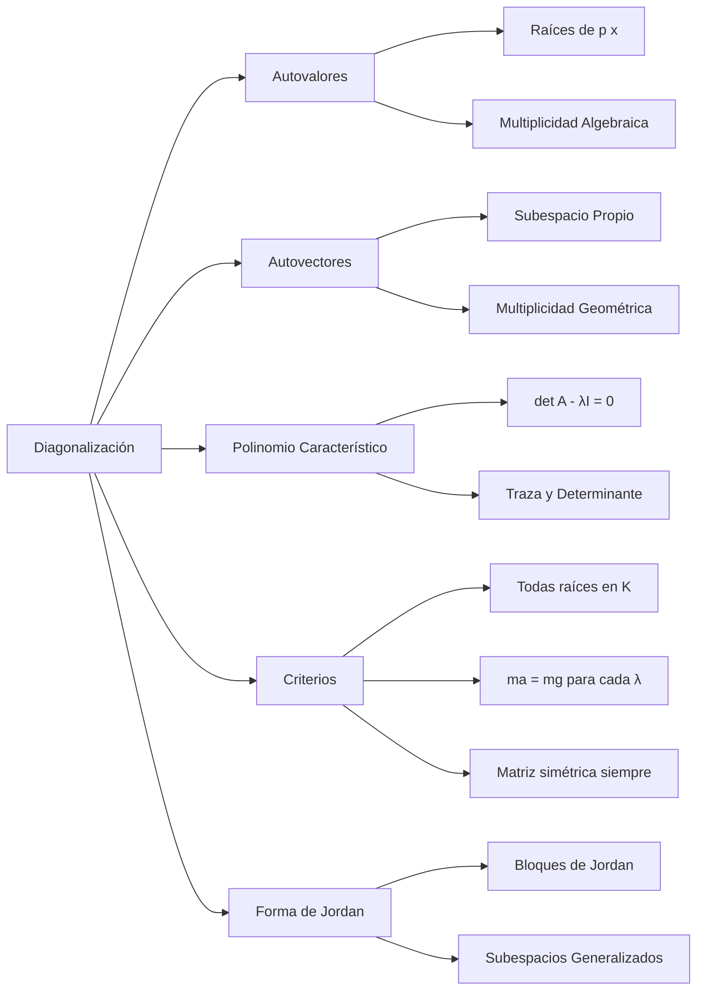
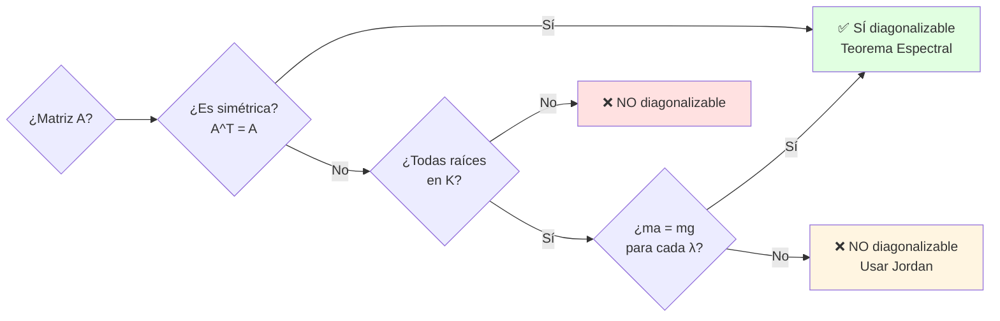

# Resumen Visual — UD4: Diagonalización y Valores Propios

## 🎯 Objetivo de la Unidad

Dominar el cálculo de autovalores y autovectores, comprender los criterios de diagonalización y aplicar la forma de Jordan cuando la diagonalización no es posible.

---

## 📊 Mapa Conceptual

---

## 📐 Conceptos Fundamentales

### Autovalor y Autovector

Para matriz $A$ (o endomorfismo $f$):

$$
A\mathbf{v} = \lambda \mathbf{v}
$$

- $\lambda$: **autovalor** (eigenvalue)
- $\mathbf{v} \neq \mathbf{0}$: **autovector** (eigenvector)

**Interpretación:** Al aplicar $A$, el vector $\mathbf{v}$ solo se escala por $\lambda$ (no rota).

### Subespacio Propio

$$
V_\lambda = \text{Ker}(A - \lambda I) = \\{\mathbf{v} : A\mathbf{v} = \lambda\mathbf{v}\\}
$$

---

## 🔍 Polinomio Característico

$$
p_A(\lambda) = \det(A - \lambda I)
$$

**Para matrices $2 \times 2$:**

$$
p(\lambda) = \lambda^2 - \text{tr}(A)\lambda + \det(A)
$$

donde $\text{tr}(A) = a_{11} + a_{22}$ (suma de la diagonal).

!!! tip "✨ Propiedades útiles"

    - Matrices semejantes tienen el **mismo polinomio característico**
    - La **traza** y el **determinante** se conservan bajo semejanza
    - Grado del polinomio = dimensión de la matriz

---

## 📊 Multiplicidades

| Tipo           | Definición                                            | Notación      | Propiedad             |
| -------------- | ----------------------------------------------------- | ------------- | --------------------- |
| **Algebraica** | Número de veces que $\lambda$ es raíz de $p(\lambda)$ | $a_i$ o $m_a$ | -                     |
| **Geométrica** | $\dim(V_\lambda) = n - \text{rg}(A - \lambda I)$      | $d_i$ o $m_g$ | $1 \leq m_g \leq m_a$ |

---

## 🔄 Árbol de Decisión: ¿Es Diagonalizable?

---

## ✅ Criterios de Diagonalización

Una matriz $A$ (n×n) es diagonalizable ⟺

1. **Todas** las raíces del polinomio característico están en $\mathbb{K}$ (ej. son reales si trabajamos en $\mathbb{R}$)
2. Para **cada** autovalor $\lambda_i$: $m_g(\lambda_i) = m_a(\lambda_i)$

### Caso Especial: Matriz Simétrica

!!! tip "✨ Teorema Espectral"

    Si $A^T = A$ (matriz simétrica real), entonces $A$ es **siempre diagonalizable**.

    No es necesario verificar multiplicidades.

---

## 🎯 Procedimiento de Diagonalización

### Paso a Paso

1. **Polinomio característico:** $p(\lambda) = \det(A - \lambda I)$
2. **Autovalores:** Resolver $p(\lambda) = 0$
3. **Multiplicidades algebraicas:** Contar repeticiones de cada raíz
4. **Para cada $\lambda_i$:**
   - Resolver $(A - \lambda_i I)\mathbf{v} = \mathbf{0}$
   - Base de $V_{\lambda_i}$ → autovectores
   - $m_g(\lambda_i) = \dim(V_{\lambda_i})$
5. **Verificar:** $\sum m_g = n$
6. **Construir $P$:** Columnas = autovectores (base de cada $V_\lambda$)
7. **Matriz diagonal:** $D = \text{diag}(\lambda_1, \ldots, \lambda_n)$

**Resultado:** $A = PDP^{-1}$ o $D = P^{-1}AP$

---

## 🧩 Forma de Jordan (cuando no es diagonalizable)

Si $A$ no es diagonalizable, buscamos su **forma de Jordan** $J$:

$$
A = PJP^{-1}
$$

### Bloque de Jordan

Para autovalor $\lambda$ y tamaño $k$:

$$
J_k(\lambda) = \begin{pmatrix}
\lambda & 1 & 0 & \cdots & 0 \\
0 & \lambda & 1 & \cdots & 0 \\
\vdots & \vdots & \ddots & \ddots & \vdots \\
0 & 0 & \cdots & \lambda & 1 \\
0 & 0 & \cdots & 0 & \lambda
\end{pmatrix}_{k \times k}
$$

**Propiedades:**

- Diagonal: autovalor $\lambda$
- Superdiagonal: unos
- Resto: ceros

### Subespacios Propios Generalizados

$$
E_k(\lambda) = \text{Ker}((A - \lambda I)^k)
$$

Forman cadena: $E_1 \subseteq E_2 \subseteq \cdots \subseteq E_m = M(\lambda)$

donde $\dim(M(\lambda)) = m_a(\lambda)$

---

## 📝 Tabla Resumen: Semejanza de Matrices

| Concepto                | Definición                                     | Notación                          |
| ----------------------- | ---------------------------------------------- | --------------------------------- |
| **Matrices semejantes** | $B = P^{-1}AP$ para alguna $P$ invertible      | $A \sim B$                        |
| **Invariantes**         | Se conservan bajo semejanza                    | tr$(A)$, det$(A)$, $p_A(\lambda)$ |
| **Diagonalizable**      | $A \sim D$ (diagonal)                          | $A = PDP^{-1}$                    |
| **Forma de Jordan**     | Más simple que $A$ cuando no es diagonalizable | $A = PJP^{-1}$                    |

---

## 💡 Aplicaciones Prácticas

### Cálculo de Potencias

Si $A = PDP^{-1}$:

$$
A^k = PD^kP^{-1}
$$

donde $D^k = \text{diag}(\lambda_1^k, \ldots, \lambda_n^k)$ es fácil de calcular.

### Sucesiones Recurrentes (Fibonacci)

La matriz $A = \begin{pmatrix} 0 & 1 \\ 1 & 1 \end{pmatrix}$ diagonalizada da la fórmula de Fibonacci:

$$
F_n = \frac{\phi^n - \psi^n}{\sqrt{5}}
$$

donde $\phi = \frac{1+\sqrt{5}}{2}$ (número áureo) y $\psi = \frac{1-\sqrt{5}}{2}$.

---

## ✅ Checklist de Ejercicios

### Para calcular autovalores:

- [ ] ¿He planteado $\det(A - \lambda I) = 0$?
- [ ] ¿He desarrollado correctamente el determinante?
- [ ] ¿He factorizado el polinomio característico?
- [ ] ¿He identificado todas las raíces?

### Para verificar diagonalización:

- [ ] ¿Es matriz simétrica? → Automáticamente diagonalizable
- [ ] ¿Todas las raíces están en $\mathbb{K}$?
- [ ] Para cada $\lambda$: ¿He calculado $m_g = n - \text{rg}(A - \lambda I)$?
- [ ] ¿Se cumple $m_g = m_a$ para todos los autovalores?
- [ ] ¿$\sum m_g = n$?

### Para construir matriz de paso:

- [ ] ¿He calculado base de cada $V_\lambda$?
- [ ] ¿Los autovectores son linealmente independientes?
- [ ] ¿Las columnas de $P$ están en el orden correcto?
- [ ] ¿He verificado $AP = PD$?

---

## 💡 Errores Comunes

!!! warning "⚠️ Cuidado con estos errores"

    - **Confundir $m_a$ y $m_g$**: Algebraica es del polinomio, geométrica es la dimensión del subespacio
    - **Olvidar verificar criterios**: No toda matriz con autovalores es diagonalizable
    - **Matriz de paso incorrecta**: Las columnas deben ser autovectores, no las filas
    - **Orden incorrecto en $D$ y $P$**: Los autovalores en $D$ deben corresponder con las columnas de $P$
    - **No verificar $A^T = A$ primero**: Ahorra mucho tiempo si la matriz es simétrica
    - **Determinante en lugar de traza**: $p(\lambda) = \lambda^2 - \text{tr}(A)\lambda + \det(A)$ (no al revés)

---

## 📝 Tabla Resumen de Fórmulas

| Concepto                 | Fórmula                                 | Observación                          |
| ------------------------ | --------------------------------------- | ------------------------------------ |
| Autovalor/vector         | $A\mathbf{v} = \lambda\mathbf{v}$       | $\mathbf{v} \neq \mathbf{0}$         |
| Polinomio característico | $p(\lambda) = \det(A - \lambda I)$      | Grado = $n$                          |
| Subespacio propio        | $V_\lambda = \text{Ker}(A - \lambda I)$ | -                                    |
| Multiplicidad geométrica | $m_g = n - \text{rg}(A - \lambda I)$    | $1 \leq m_g \leq m_a$                |
| Diagonalización          | $A = PDP^{-1}$                          | $P$ tiene autovectores como columnas |
| Potencias                | $A^k = PD^kP^{-1}$                      | $D^k$ es diagonal de $\lambda_i^k$   |
| Traza (2×2)              | $\text{tr}(A) = a_{11} + a_{22}$        | Para polinomio característico        |
| Forma de Jordan          | $A = PJP^{-1}$                          | Cuando no es diagonalizable          |

---

## 🔗 Enlaces Relacionados

- [Ejercicios Resueltos UD4](ejercicios-resueltos.md)
- [Ejercicios Propuestos UD4](ejercicios-propuestos.md)
- [Diagonalización 2×2](diagonalizacion-paso-a-paso.md)
- [Diagonalización 3×3](diagonalizacion-paso-a-paso-3x3.md)
- [Forma de Jordan](forma-jordan.md)
- [UD5: Teoría de Grafos](../ud5/index.md)
