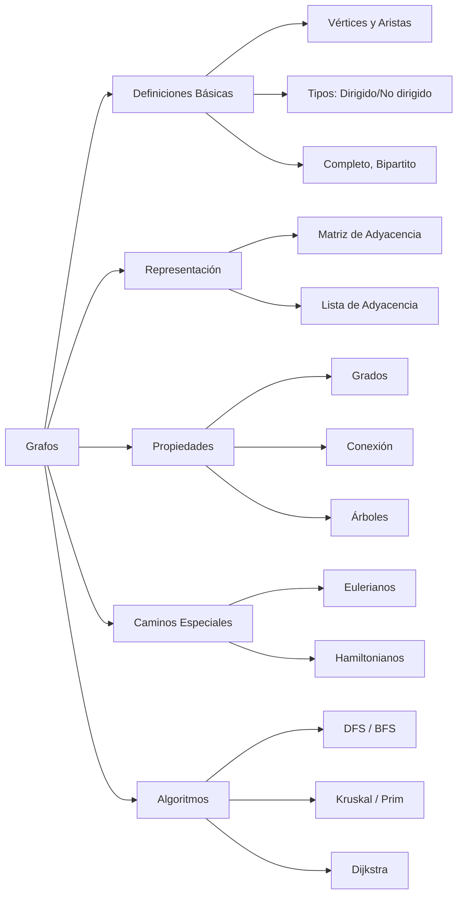
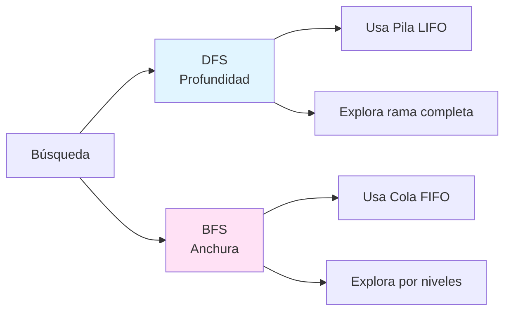
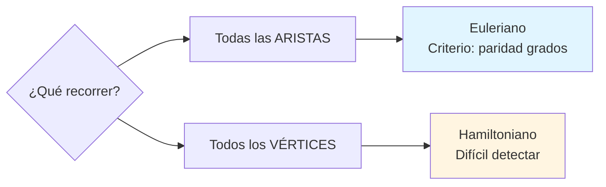

# Resumen Visual — UD5: Teoría de Grafos

## 🎯 Objetivo de la Unidad

Comprender los conceptos fundamentales de la teoría de grafos, sus representaciones, propiedades y algoritmos principales (recorridos, caminos especiales y optimización en redes).

---

## 📊 Mapa Conceptual

---

## 📐 Conceptos Fundamentales

### Grafo

Un grafo $G = (V, E)$ consta de:

- $V$: conjunto de **vértices** (nodos)
- $E$: conjunto de **aristas** (lados, edges)

**Tipos principales:**

| Tipo                    | Característica                          | Ejemplo                                 |
| ----------------------- | --------------------------------------- | --------------------------------------- |
| **Simple**              | Sin bucles ni aristas múltiples         | Grafo social                            |
| **Dirigido** (Dígrafo)  | Aristas con dirección                   | Red de calles                           |
| **Completo** $K_n$      | Todos conectados entre sí               | $K_5$ tiene $\binom{5}{2} = 10$ aristas |
| **Bipartito** $K_{n,m}$ | Dos conjuntos, aristas solo entre ellos | Empleados-Proyectos                     |

---

## 🔢 Grados y Lema del Saludo

### Definición de Grado

- **Grado** $\delta(v)$: número de aristas incidentes en vértice $v$

### Lema del Saludo (Teorema Fundamental)

$$
\sum_{v \in V} \delta(v) = 2|E|
$$

**Interpretación:** La suma de todos los grados es el doble del número de aristas (cada arista se cuenta dos veces).

!!! tip "✨ Consecuencia"

    Siempre hay un **número par de vértices con grado impar**.

### Grafos Dirigidos

- **Grado de salida** $\delta^+(v)$: aristas que salen
- **Grado de entrada** $\delta^-(v)$: aristas que entran
- **Fuente**: $\delta^-(v) = 0$
- **Sumidero**: $\delta^+(v) = 0$

---

## 📊 Representación: Matriz de Adyacencia

Para grafo con $n$ vértices, matriz $A$ de $n \times n$:

$$
A[i,j] = \begin{cases}
1 & \text{si existe arista de } v_i \text{ a } v_j \\
0 & \text{en caso contrario}
\end{cases}
$$

**Propiedades:**

- Grafo no dirigido: $A$ es **simétrica** ($A^T = A$)
- Suma de fila $i$ = $\delta^+(v_i)$ (grado salida)
- Suma de columna $j$ = $\delta^-(v_j)$ (grado entrada)

---

## 🌳 Árboles

### Definición

Un **árbol** es un grafo:

1. Simple
2. Conexo
3. Acíclico (sin ciclos)

**Propiedad fundamental:**

$$
|V| = |E| + 1
$$

Para $n$ vértices, un árbol tiene exactamente $n-1$ aristas.

### Árbol Enraizado (Arborescencia)

- **Raíz**: vértice designado como inicio
- **Nivel**: distancia desde la raíz
- **Hoja**: vértice sin hijos
- **Padre/Hijo**: relación de adyacencia

---

## 🔄 Algoritmos de Recorrido

### DFS (Depth-First Search)

**Estructura:** Pila (LIFO - Last In, First Out)

**Cuándo usar:**

- Detectar ciclos
- Topological sort
- Explorar todas las posibilidades

### BFS (Breadth-First Search)

**Estructura:** Cola (FIFO - First In, First Out)

**Cuándo usar:**

- Camino más corto (sin pesos)
- Explorar por niveles
- Vecinos más cercanos

---

## 🚶 Caminos y Ciclos

### Definiciones

| Concepto          | Definición                     | Repetición             |
| ----------------- | ------------------------------ | ---------------------- |
| **Cadena/Camino** | Sucesión de vértices y aristas | Puede repetir          |
| **Camino simple** | Camino sin repetir vértices    | No repite vértices     |
| **Circuito**      | Camino cerrado                 | Puede repetir vértices |
| **Ciclo**         | Circuito sin repetir vértices  | Solo inicial=final     |

### Conexión

- **Grafo conexo**: Existe camino entre cualquier par de vértices
- **Componente conexa**: Subgrafo máximo conexo
- **Fuertemente conexo** (dígrafos): Camino de ida y vuelta entre todo par

---

## 🔄 Caminos Eulerianos

> **Pregunta:** ¿Se puede recorrer un grafo pasando por **todas las aristas** exactamente una vez?

### Teorema de Euler

| Condición                                      | Resultado                                           |
| ---------------------------------------------- | --------------------------------------------------- |
| **Todos** los vértices tienen grado **par**    | Existe **ciclo euleriano** (cerrado)                |
| Exactamente **2** vértices con grado **impar** | Existe **camino euleriano** (abierto, entre esos 2) |
| Más de 2 con grado impar                       | **No** existe camino euleriano                      |

!!! tip "✨ Regla mental"

    Euler se preocupa por las **aristas** (todas deben usarse una vez).

---

## 🎯 Caminos Hamiltonianos

> **Pregunta:** ¿Se puede recorrer un grafo pasando por **todos los vértices** exactamente una vez?

### Criterios Suficientes

**Teorema de Dirac:**
Si $\delta(v) \geq n/2$ para **todo** vértice, entonces existe **ciclo hamiltoniano**.

**Teorema de Ore:**
Si $\delta(u) + \delta(v) \geq n$ para todo par de vértices **no adyacentes**, entonces existe ciclo hamiltoniano.

!!! warning "⚠️ Importante"

    No hay criterio necesario y suficiente sencillo. Estos teoremas garantizan existencia, pero su fallo no garantiza inexistencia.

!!! tip "✨ Regla mental"

    Hamilton se preocupa por los **vértices** (todos deben visitarse una vez).

---

## 🔄 Diferencia Euler vs Hamilton

---

## 🕸️ Redes y Algoritmos de Optimización

### Red

**Grafo ponderado**: Cada arista tiene un **peso** (coste, distancia, tiempo).

**Representación:** Matriz de costes $C$ donde $C[i,j] = \infty$ si no hay arista.

---

## 🌲 Árbol Generador de Mínimo Coste (MST)

> **Objetivo:** Conectar todos los vértices con la **mínima suma de pesos**.

### Algoritmo de Kruskal

**Estrategia:** Ordenar aristas por peso y añadir de menor a mayor, **evitando ciclos**.

**Pasos:**

1. Ordenar aristas por peso creciente
2. Inicializar bosque vacío
3. Para cada arista (menor a mayor):
   - Si NO forma ciclo → añadir
   - Si forma ciclo → descartar
4. Terminar cuando se tengan $n-1$ aristas

### Algoritmo de Prim

**Estrategia:** Crecer el árbol desde un vértice inicial, añadiendo siempre la arista de **menor peso** que conecta al árbol.

**Pasos:**

1. Comenzar desde vértice arbitrario
2. En cada paso: añadir arista de menor peso que una un vértice del árbol con uno fuera
3. Terminar cuando todos los vértices estén en el árbol

---

## 🛣️ Algoritmo de Dijkstra (Camino Mínimo)

> **Objetivo:** Encontrar el camino de **mínimo coste** desde un origen a todos los demás vértices.

**Restricción:** Funciona solo con **pesos no negativos**.

**Pasos:**

1. Inicializar distancia del origen = 0, resto = $\infty$
2. Marcar todos como no visitados
3. Mientras haya no visitados:
   - Elegir vértice no visitado con **menor distancia**
   - Para cada vecino:
     - Calcular distancia alternativa (actual + peso arista)
     - Si es menor → actualizar
   - Marcar vértice como visitado
4. Al final: tabla con distancias mínimas y predecesores

!!! warning "❗ Limitación"

    Dijkstra **no funciona con pesos negativos**. Para esos casos usar Bellman-Ford.

---

## ✅ Checklist de Ejercicios

### Para identificar tipo de grafo:

- [ ] ¿Tiene bucles? → No es simple
- [ ] ¿Las aristas tienen dirección? → Es dirigido
- [ ] ¿Todos los pares conectados? → Es completo $K_n$
- [ ] ¿Se divide en dos conjuntos? → Es bipartito

### Para camino euleriano:

- [ ] ¿He contado el grado de cada vértice?
- [ ] ¿Todos tienen grado par? → Ciclo euleriano
- [ ] ¿Exactamente 2 impares? → Camino euleriano
- [ ] ¿Más de 2 impares? → No existe

### Para camino hamiltoniano:

- [ ] ¿He verificado teorema de Dirac? ($\delta(v) \geq n/2$)
- [ ] ¿He verificado teorema de Ore? (suma grados no adyacentes)
- [ ] Si ambos fallan, ¿he intentado construcción directa?

### Para MST (Kruskal/Prim):

- [ ] ¿He ordenado aristas por peso? (Kruskal)
- [ ] ¿He verificado que no se forman ciclos?
- [ ] ¿El árbol tiene $n-1$ aristas?
- [ ] ¿He calculado el coste total?

### Para Dijkstra:

- [ ] ¿He inicializado distancias correctamente?
- [ ] ¿He actualizado distancias en cada iteración?
- [ ] ¿He marcado vértices visitados?
- [ ] ¿He reconstruido el camino usando predecesores?

---

## 💡 Errores Comunes

!!! warning "⚠️ Cuidado con estos errores"

    - **Confundir Euler y Hamilton**: Euler = aristas, Hamilton = vértices
    - **Lema del saludo mal aplicado**: Es $2|E|$, no $|E|$
    - **Matriz de adyacencia**: En grafos no dirigidos debe ser simétrica
    - **Árboles**: Siempre $|V| = |E| + 1$, verificar esto
    - **Dijkstra con pesos negativos**: No funciona, usar Bellman-Ford
    - **Kruskal sin ordenar**: Las aristas deben procesarse de menor a mayor peso

---

## 📝 Tabla Resumen de Algoritmos

| Algoritmo    | Objetivo                     | Complejidad              | Restricciones |
| ------------ | ---------------------------- | ------------------------ | ------------- |
| **DFS**      | Recorrer grafo (profundidad) | $O(V + E)$               | -             |
| **BFS**      | Recorrer grafo (anchura)     | $O(V + E)$               | -             |
| **Kruskal**  | MST                          | $O(E \log E)$            | -             |
| **Prim**     | MST                          | $O(E \log V)$            | -             |
| **Dijkstra** | Camino mínimo                | $O(V^2)$ o $O(E \log V)$ | Pesos ≥ 0     |

---

## 🔗 Enlaces Relacionados

- [Ejercicios Resueltos UD5](ejercicios-resueltos.md)
- [Ejercicios Propuestos UD5](ejercicios-propuestos.md)
- [Definiciones](definiciones.md)
- [Árboles DFS/BFS](arboles-dfs-bfs.md)
- [Euler y Hamilton](euler-hamilton.md)
- [Redes MST Dijkstra](redes-mst-dijkstra.md)
- [UD6: Combinatoria](../ud6/index.md)
