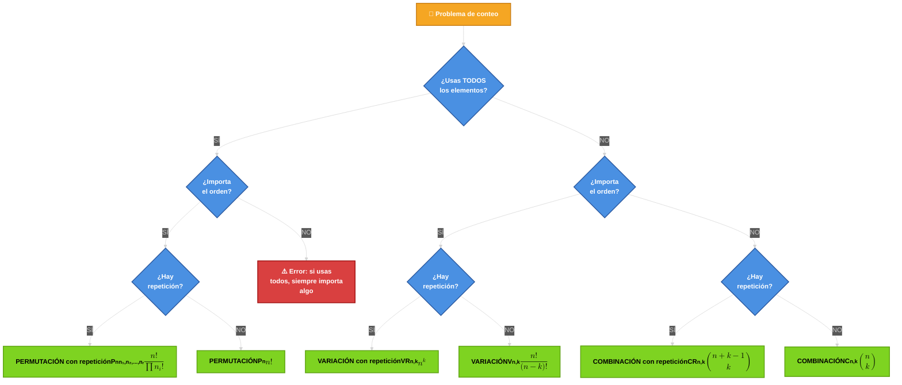

title: "UD6 — Combinatoria"
slug: "ud6-combinatoria"
date: "2026-01-10"
authors: ["Profesor Ejemplo","Raul Jimenez"]
tags: ["ud6","combinatoria"]
difficulty: "intermedio"
type: "definicion"
prerequisitos: ["ud1-fundamentos"]

---

## ✨ Objetivo

Dominar las **técnicas fundamentales de conteo** en combinatoria: entender qué son permutaciones, variaciones y combinaciones, **cuándo y cómo usarlas**, y ver por qué la diferencia entre "importa el orden" y "no importa el orden" es crítica.

---

## 🤔 ¿Qué es la combinatoria y por qué la estudiamos?

La **combinatoria** es el arte de contar sin enumerar. En lugar de listar todas las posibilidades, usamos fórmulas para calcular cuántas hay.

!!! tip "✨ Ejemplo motivador"

    Si tienes 49 números en la lotería y debes elegir 6, ¿cuántos boletos diferentes necesitas comprar para estar seguro de ganar? **${49\choose6} = 10.068.347$ boletos**. Sin combinatoria, tendrías que escribir cada uno a mano; con combinatoria, una fórmula te da la respuesta en segundos.

**Aplicaciones reales:**

- Criptografía: ¿cuántas contraseñas posibles hay?
- Probabilidad: ¿cuál es la probabilidad de una mano de póker?
- Diseño: ¿cuántas configuraciones de un sistema existen?
- Logística: ¿de cuántas maneras se pueden ordenar elementos?

---

## 🎯 La pregunta decisiva: un árbol de decisión

Antes de aplicar cualquier fórmula, pregúntate en este orden:

Este árbol te guiará a la fórmula correcta. **Veamos cada rama.**

## 📋 Tabla resumen conceptual

| Concepto                       | ¿Usas todos los elementos? | ¿Importa el orden? | ¿Hay repetición? | Fórmula                                  | Ejemplo                           |
| ------------------------------ | :------------------------: | :----------------: | :--------------: | ---------------------------------------- | --------------------------------- |
| **Permutación**                |             Sí             |         Sí         |        No        | $P_n = n!$                               | Ordenes de 5 personas en una fila |
| **Permutación con repetición** |             Sí             |         Sí         |        Sí        | $P_n^{n_1,\dots}=\dfrac{n!}{\prod n_i!}$ | Anagramas de "BANANA"             |
| **Variación sin repetición**   |             No             |         Sí         |        No        | $V_{n,k}=\dfrac{n!}{(n-k)!}$             | Top 3 medallas de 8 atletas       |
| **Variación con repetición**   |             No             |         Sí         |        Sí        | $VR_{n,k}=n^k$                           | Contraseñas de 4 dígitos          |
| **Combinación sin repetición** |             No             |         No         |        No        | $C_{n,k}={n\choose k}$                   | Elegir 6 números de 49 (lotería)  |
| **Combinación con repetición** |             No             |         No         |        Sí        | $CR_{n,k}={n+k-1\choose k}$              | Raciones de 3 sabores de 5 tipos  |

---

## 🧭 Las 6 técnicas de conteo explicadas en detalle

### ✳️ 1. Permutaciones (P_n)

#### ¿Qué es?

Ordena **todos** los $n$ elementos distintos de un conjunto. Es la respuesta a "¿de cuántas formas puedo organizar todo?"

#### ¿Para qué sirve?

- Organización de personas, libros, elementos físicos
- Cualquier problema donde la posición importa **y usas todo**
- Caso base para otras fórmulas

#### ¿Cuándo la usas?

Cuando:

- ✅ Tienes $n$ elementos en total
- ✅ Importa el orden (BANANA ≠ NABANA)
- ✅ Los usas todos
- ⚠️ **PERO algunos elementos son idénticos** (hay frecuencias $n_1, n_2, \dots$)

#### Fórmula

$$P_n^{n_1,n_2,\dots,n_r} = \frac{n!}{n_1! \cdot n_2! \cdots n_r!}$$

**Intuición:** Calculas $n!$ como si todos fuesen distintos, pero luego divides por los factoriales de las frecuencias para "descontar" las permutaciones idénticas.

#### Ejemplo paso a paso

**Pregunta:** ¿Cuántos anagramas tiene la palabra "BANANA"?

**Análisis:**

- Total de letras: $n = 6$
- Frecuencias: B aparece 1 vez, A aparece 3 veces, N aparece 2 veces
- Es decir: $n_B=1, n_A=3, n_N=2$

$$P_6^{1,3,2} = \frac{6!}{1! \cdot 3! \cdot 2!} = \frac{720}{1 \cdot 6 \cdot 2} = \frac{720}{12} = 60$$

**¿Por qué dividimos?** Si tratamos todas las letras como distintas (p. ej. A₁, A₂, A₃), habría $6! = 720$ ordenaciones. Pero muchas son idénticas porque no podemos diferenciar entre A₁A₂A₃ y A₃A₁A₂. Hay $3!$ formas de "permutar las A's" internamente, así que dividimos por $3!$. Igual con las N's ($2!$).

---

### ✳️ 3. Variaciones sin repetición (V\_{n,k})

#### ¿Qué es?

Elige $k$ elementos de $n$ disponibles **y ordénalos**, sin poder repetir ninguno. Es como "permutaciones de un subconjunto".

#### ¿Para qué sirve?

- Podios deportivos (1er, 2º, 3er lugar)
- Élites de un grupo (presidente, vicepresidente, tesorero de $n$ candidatos)
- Códigos donde importa la secuencia y sin dígitos repetidos
- Top-k rankings

#### ¿Cuándo la usas?

Cuando:

- ✅ Eliges $k$ elementos de $n$ (no todos)
- ✅ Importa el orden (medalla de oro ≠ medalla de plata)
- ✅ **No hay repetición** (cada elemento se usa como máximo una vez)

#### Fórmula

$$V_{n,k} = \frac{n!}{(n-k)!} = n \cdot (n-1) \cdot (n-2) \cdots (n-k+1)$$

**Intuición:** La primera posición tiene $n$ opciones, la segunda tiene $n-1$, ..., la $k$-ésima tiene $n-k+1$ opciones. Multiplicamos.

#### Ejemplo paso a paso

**Pregunta:** En una carrera de 8 atletas, ¿cuántas formas diferentes puede haber para el podio (oro, plata, bronce)?

$$V_{8,3} = \frac{8!}{(8-3)!} = \frac{8!}{5!} = 8 \cdot 7 \cdot 6 = 336$$

**¿Por qué?**

- Oro: 8 opciones (cualquiera de los 8)
- Plata: 7 opciones (quedan 7)
- Bronce: 6 opciones (quedan 6)

**Resultado:** 336 formas diferentes.

**Comparación con permutaciones:** Es como permutación pero solo de los primeros $k$ elementos.

---

### ✳️ 4. Variaciones con repetición (VR\_{n,k})

#### ¿Qué es?

Elige $k$ elementos de $n$ disponibles **y ordénalos**, permitiendo repetición. Es como llenar $k$ posiciones donde cada una puede tomar $n$ valores diferentes.

#### ¿Para qué sirve?

- Contraseñas y PINs
- Códigos de barras o identificadores
- Lanzamientos de dados múltiples
- Cualquier secuencia donde cada posición es independiente

#### ¿Cuándo la usas?

Cuando:

- ✅ Eliges $k$ elementos de $n$
- ✅ Importa el orden
- ✅ **Sí hay repetición** (puedes usar el mismo elemento varias veces)

#### Fórmula

$$VR_{n,k} = n^k$$

**Intuición:** Cada posición tiene $n$ opciones independientemente. Como hay $k$ posiciones, multiplicamos $n \times n \times \cdots \times n$ (k veces).

#### Ejemplo paso a paso

**Pregunta:** ¿Cuántas contraseñas de 4 dígitos se pueden formar con los dígitos 0–9?

$$VR_{10,4} = 10^4 = 10.000$$

**¿Por qué?**

- Posición 1: 10 opciones (0–9)
- Posición 2: 10 opciones (0–9, sin restricción)
- Posición 3: 10 opciones (0–9)
- Posición 4: 10 opciones (0–9)

**Resultado:** 10.000 contraseñas posibles.

---

### ✳️ 5. Combinaciones sin repetición (C\_{n,k} o $\binom{n}{k}$)

#### ¿Qué es?

Elige $k$ elementos de $n$, **sin importar el orden** y sin repetición. Es la respuesta a "¿cuántos grupos puedo hacer?"

#### ¿Para qué sirve?

- Lotería, rifa (elegir 6 números de 49)
- Equipos o comisiones (elegir 5 personas de 20)
- Combinaciones de colores, sabores, ingredientes
- Cualquier problema donde "quién" importa pero el orden no

#### ¿Cuándo la usas?

Cuando:

- ✅ Eliges $k$ elementos de $n$
- ✅ **NO importa el orden** ({A,B,C} = {C,B,A})
- ✅ No hay repetición

#### Fórmula

$$C_{n,k} = \binom{n}{k} = \frac{n!}{k!(n-k)!}$$

**Intuición:** Empiezas con variaciones ($\dfrac{n!}{(n-k)!}$), pero eso cuenta cada combinación $k!$ veces (una por cada ordenación). Divides por $k!$ para eliminar el overcounting.

#### Ejemplo paso a paso

**Pregunta:** En un grupo de 10 amigos, ¿cuántos equipos de 3 puedo formar?

$$C_{10,3} = \binom{10}{3} = \frac{10!}{3! \cdot 7!} = \frac{10 \cdot 9 \cdot 8}{3 \cdot 2 \cdot 1} = \frac{720}{6} = 120$$

**¿Por qué?**

- Si el orden importase (presidente, vicepresidente, tesorero): $V_{10,3} = 10 \cdot 9 \cdot 8 = 720$
- Pero como el orden no importa (todos en el mismo equipo), cada equipo se cuenta $3! = 6$ veces
- Dividimos: $\dfrac{720}{6} = 120$

**Resultado:** 120 equipos posibles.

---

### ✳️ 6. Combinaciones con repetición (CR\_{n,k} o $\binom{n+k-1}{k}$)

#### ¿Qué es?

Elige $k$ elementos de $n$, **sin importar el orden y permitiendo repetición**. Es para cuando puedes elegir el mismo elemento varias veces pero lo único que importa es cuántos de cada tipo.

#### ¿Para qué sirve?

- Distribución de recursos idénticos (raciones, dulces, bolas)
- Mezclas de ingredientes donde el orden no importa
- Problemas de "stars and bars"
- Ecuaciones diofánticas (cuántas formas de hacer $x_1 + x_2 + x_3 = n$)

#### ¿Cuándo la usas?

Cuando:

- ✅ Eliges $k$ elementos de $n$
- ✅ **NO importa el orden**
- ✅ **SÍ hay repetición** (puedes elegir el mismo tipo varias veces)

#### Fórmula

$$CR_{n,k} = \binom{n+k-1}{k} = \binom{n+k-1}{n-1} = \frac{(n+k-1)!}{k!(n-1)!}$$

**Intuición:** Es equivalente a distribuir $k$ objetos idénticos en $n$ tipos distinguibles (como poner bolas en cajas). Se puede demostrar con "stars and bars": imagina $k$ estrellas (\*) y $n-1$ barras (|); el número de formas de organizarlas es la combinación de $n+k-1$ posiciones eligiendo dónde van las $k$ estrellas.

#### Ejemplo paso a paso

**Pregunta:** Una heladería ofrece 5 sabores. ¿Cuántas formas hay de elegir 3 bolas (pudiendo repetir sabor)?

$$CR_{5,3} = \binom{5+3-1}{3} = \binom{7}{3} = \frac{7!}{3! \cdot 4!} = \frac{7 \cdot 6 \cdot 5}{3 \cdot 2 \cdot 1} = \frac{210}{6} = 35$$

**¿Por qué?**

- Ejemplos de respuestas: (V,V,V), (V,V,F), (V,F,F), (F,F,F), (C,C,V), etc.
- Lo importante es cuántas de cada sabor, no el orden

**Resultado:** 35 formas diferentes.

---

## 🔑 Comparaciones clave que quería resolver

### Variación vs. Combinación: ¿cuál es la diferencia real?

**¡Tienes razón en tu intuición!** Variación y combinación son "casi lo mismo", pero la diferencia de orden es crítica:

|                       | Variación                        | Combinación                                             |
| --------------------- | -------------------------------- | ------------------------------------------------------- |
| **Fórmula**           | $V_{n,k}=\dfrac{n!}{(n-k)!}$     | $C_{n,k}=\dfrac{n!}{k!(n-k)!}$                          |
| **Diferencia**        | Variación = Combinación × $k!$   | Combinación = Variación ÷ $k!$                          |
| **Cuándo**            | El orden importa                 | El orden no importa                                     |
| **Ejemplo**           | Medallas (oro≠plata)             | Equipos (todos iguales)                                 |
| **Regla nemotécnica** | "**V**ariación = Orden **V**ita" | "**C**ombinación = **C**ontingente (da igual el orden)" |

!!! tip "Ver demostración matemática"

    Si tienes $V_{n,k}$ ordenaciones distintas, ¿cuántas representan el mismo grupo de $k$ elementos?

    Respuesta: **$k!$ ordenaciones diferentes**.

    Ejemplo: {A,B,C} desde {A,B,C,D,E} es 1 grupo.
    Pero en variaciones, cuenta como:

    - (A,B,C) ← orden 1
    - (A,C,B) ← orden 2
    - (B,A,C) ← orden 3
    - (B,C,A) ← orden 4
    - (C,A,B) ← orden 5
    - (C,B,A) ← orden 6

    Son $3! = 6$ órdenes del mismo grupo.

    Por tanto: $C_{n,k} = \dfrac{V_{n,k}}{k!}$, o al revés: $V_{n,k} = C_{n,k} \cdot k!$

---

### Repetición sí / repetición no

La repetición **dobla la complejidad**:

**Sin repetición:** cada elemento entra como máximo una vez.

- Ej: Elegir 3 de {A,B,C,D} sin repetir → máximo {A,B,C}

**Con repetición:** cada elemento se puede elegir varias veces.

- Ej: Elegir 3 de {A,B} con repetir → {A,A,A}, {A,A,B}, {A,B,B}, {B,B,B}

!!! warning "❗️ Error común"

    No confundas "repetición" con "orden". Son independientes:

    - Variación SIN rep: orden SÍ, repetir NO
    - Variación CON rep: orden SÍ, repetir SÍ
    - Combinación SIN rep: orden NO, repetir NO
    - Combinación CON rep: orden NO, repetir SÍ

---

## 📊 Relación entre las 6 técnicas

Todas las fórmulas están relacionadas. Aquí el "árbol genealógico":

$$
\boxed{P_n = n!}
\quad \rightarrow \text{(restricción: $k=n$)}
$$

$$
\boxed{V_{n,k} = \frac{n!}{(n-k)!}} \quad \leftarrow \text{(extensión)}
\quad \text{y} \quad
\boxed{VR_{n,k} = n^k} \quad \text{(repetición sí)}
$$

$$
\boxed{C_{n,k} = \frac{V_{n,k}}{k!} = \frac{n!}{k!(n-k)!}} \quad \leftarrow \text{(división por $k!$ → orden no importa)}
$$

$$
\boxed{CR_{n,k} = {n+k-1\choose k}} \quad \text{(caso especial: elementos indistinguibles)}
$$

---

## 📚 Ejemplos clasificados por tipo

### Permutaciones

1. "Ordena 5 libros en una estantería" → $P_5 = 5!$
2. "¿De cuántas formas se sientan 6 personas?" → $P_6 = 6!$

### Permutaciones con repetición

3. "Anagramas de AABBCC" → $P_6^{2,2,2} = \dfrac{6!}{2!2!2!}$
4. "Formas de ordenar BANANA" → $P_6^{1,3,2}$

### Variaciones sin repetición

5. "Medallas (O,P,B) de 10 atletas" → $V_{10,3}$
6. "Top 5 de 50 películas" → $V_{50,5}$

### Variaciones con repetición

7. "PINs de 4 dígitos" → $VR_{10,4} = 10^4$
8. "Placas con 3 letras" → $VR_{26,3} = 26^3$

### Combinaciones sin repetición

9. "Lotería 6 de 49" → $C_{49,6} = \binom{49}{6}$
10. "Elegir 5 de 20 estudiantes" → $C_{20,5}$

### Combinaciones con repetición

11. "Raciones de 3 helados de 5 sabores" → $CR_{5,3}$
12. "Distribución de 10 caramelos entre 4 niños" → $CR_{4,10}$

---

## 💡 Consejos y trucos de experto

!!! tip "✨ Estrategias para resolver problemas"

    1. **Lee dos veces:** muchos errores vienen de no leer bien el enunciado. "Elegir" suena indiferente, pero si hay números después (posiciones, rangos), entonces importa el orden.

    2. **Identifica restricciones:** ¿dice "sin repetir"? ¿"primer dígito no es 0"? ¿"dos personas no juntas"? Estas cambian todo.

    3. **Simplifica antes:** calcula $\dfrac{n}{(n-k)}$ para variaciones antes de expandir factoriales grandes.

    4. **Usa "bloques":** si dos elementos deben estar juntos, tratalos como un único bloque y reduce el problema.

    5. **Usa complemento:** si contar los "malos" es más fácil, resta del total.

    6. **Chequea el árbol de decisión:** antes de aplicar una fórmula, verifica que contestaste correctamente todas las preguntas del árbol.

!!! warning "❗️ Errores comunes a evitar"

    - Confundir variación (con orden) y combinación (sin orden).
    - Olvidar que $0! = 1$ (causa problemas en casos límite).
    - Calcular mal frecuencias en permutaciones con repetición.
    - No simplificar factoriales antes de multiplicar (números muy grandes).
    - Pensar que "seleccionar" siempre significa "sin orden" (¡no siempre!).
    - Olvidar que "sin repetición" y "con repetición" son independientes del "orden".

---

## 🧪 Ejercicios propuestos

Resuelve y consulta la solución haciendo clic en "Respuesta". Sigue el patrón: enunciado, solución con fórmula, cálculo y explicación del método.

Pregunta 1 — ¿Cuántas palabras distintas se pueden formar con las letras de "aabbbc"?

???- example "Respuesta"

    Aplicamos permutación con repetición con $n=6$, $n_a=2,n_b=3,n_c=1$.

    $$
    \frac{6!}{2!\,3!\,1!}
    $$

    Cálculo: $6!=720$, denominador $2!\cdot3!\cdot1!=12$, así

    $$
    \frac{720}{12} = 60
    $$

    **Resultado:** 60.

    **Por qué este método:** hay repetición de letras y *sí* importa el orden (anagramas), por eso usamos la permutación con repetición. Truco: contar frecuencias primero.

Pregunta 2 — ¿Cuántos números de tres cifras sin repetición se pueden formar con los dígitos $\{1,2,3,4,5\}$?

???- example "Respuesta"

    Usamos variación sin repetición: $V_{5,3}=\dfrac{5!}{(5-3)!}=\dfrac{120}{2}=60$.

    **Resultado:** 60.

    **Por qué este método:** elegimos y ordenamos 3 elementos de 5 sin repetir, por tanto las variaciones sin repetición son la elección natural.

Pregunta 3 — De cuántas maneras se pueden sentar 6 personas en una fila si dos personas concretas no pueden estar juntas?

???- example "Respuesta"

    Total sin restricción: $6! = 720$.

    Permutaciones donde las dos están juntas (las consideramos bloque): $5!\cdot2! = 240$.

    Restamos: $720 - 240 = 480$.

    **Resultado:** 480.

    **Por qué este método:** más sencillo contar el total y restar los casos prohibidos (complemento). Trucos: cuando la prohibición es "no juntos", suele ser cómodo usar el bloque.

Pregunta 4 — ¿Cuántas soluciones enteras no negativas tiene $x_1+x_2+x_3=5$ (interpretado como elegir 5 objetos indistinguibles entre 3 tipos)?

???- example "Respuesta"

    Es un problema de combinación con repetición: $n=3,k=5$.

    $$
    CR_{3,5} = {3+5-1 \choose 5} = {7\choose5} = {7\choose2} = 21
    $$

    **Resultado:** 21.

    **Por qué este método:** las variables son indistinguibles dentro de cada unidad (repetición permitida) y el orden no importa → combinación con repetición.

---

## 🔍 Más información y recursos

Para profundizar:

- [Resumen UD6](docs/ud6/resumen.md#L1) — tabla de referencia rápida
- [Ejercicios UD6](docs/ud6/ejercicios.md#L1) — prácticos con soluciones completas
- [Examen de Formulación](docs/ud6/examen-formulacion.md#L1) — 9 preguntas de asociación fórmulas-conceptos
- [Examen Práctico](docs/ud6/examen-practico.md#L1) — 11 problemas típicos nivel medio
