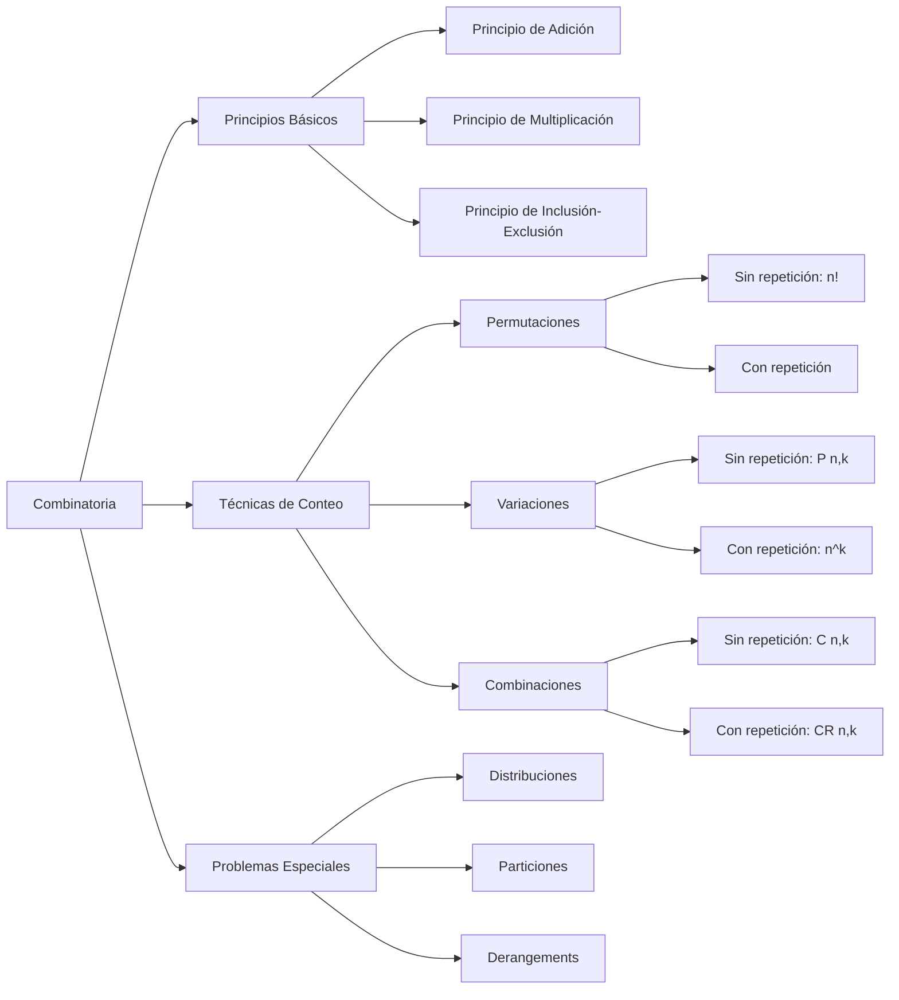
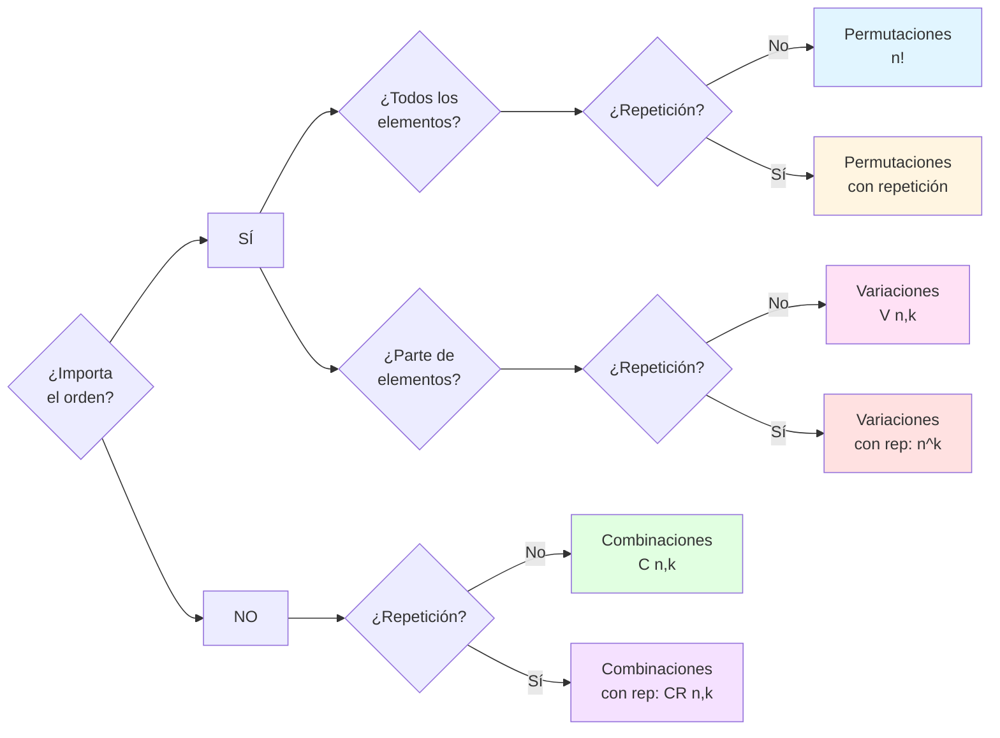
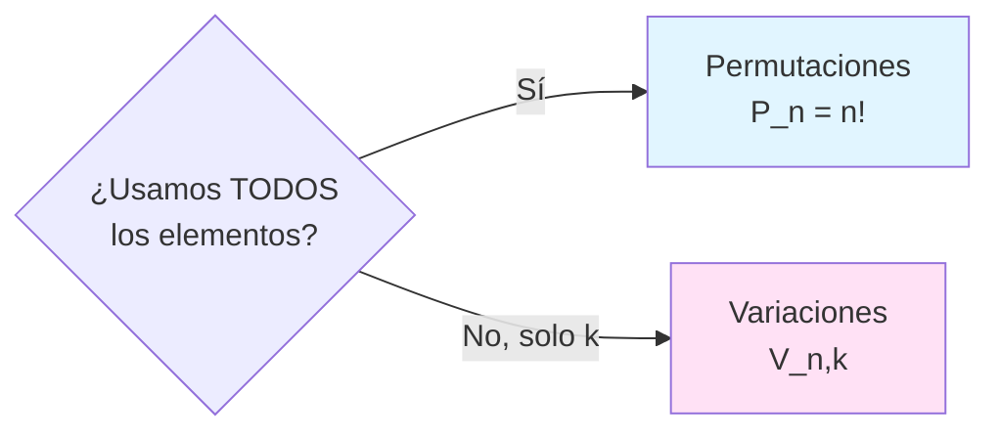
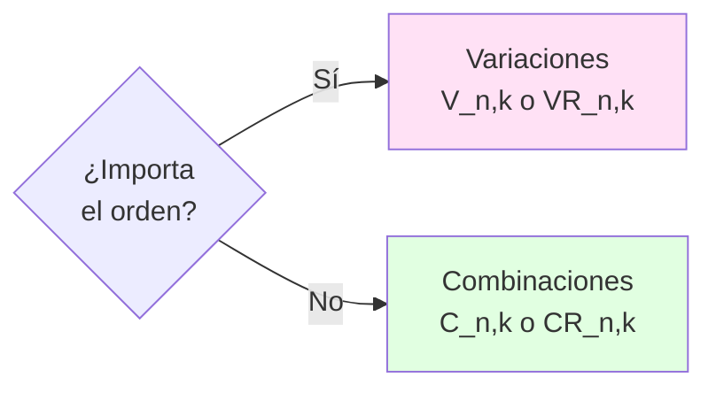
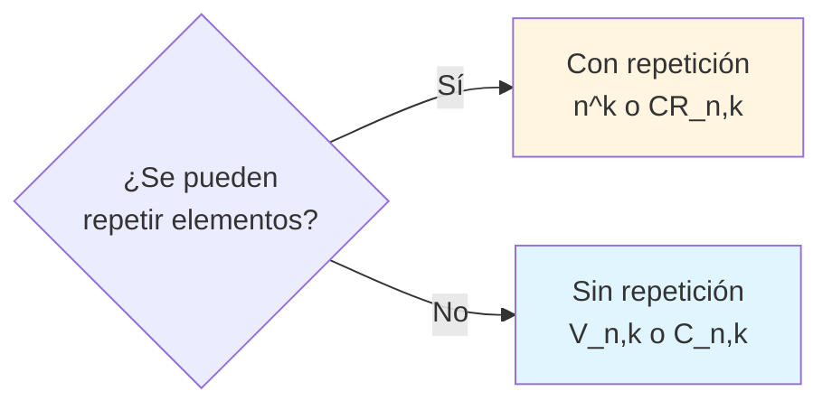

# Resumen Visual — UD6: Combinatoria y Conteo

## 🎯 Objetivo de la Unidad

Dominar las técnicas de conteo combinatorio: variaciones, permutaciones, combinaciones y el principio de inclusión-exclusión, aplicados a problemas de selección y ordenación.

---

## 📊 Mapa Conceptual

---

## 📐 Conceptos Fundamentales

### Principios Básicos de Conteo

#### 1. Principio de Adición

Si una acción se puede realizar de $m$ formas **o** de $n$ formas (excluyentes), el total es:

$$
m + n
$$

#### 2. Principio de Multiplicación

Si una acción se realiza en $k$ pasos secuenciales, con $n_1, n_2, \ldots, n_k$ opciones respectivamente, el total es:

$$
n_1 \times n_2 \times \cdots \times n_k
$$

#### 3. Principio de Inclusión-Exclusión

Para dos conjuntos:

$$
|A \cup B| = |A| + |B| - |A \cap B|
$$

Para tres conjuntos:

$$
|A \cup B \cup C| = |A| + |B| + |C| - |A \cap B| - |A \cap C| - |B \cap C| + |A \cap B \cap C|
$$

---

## 🔢 Tabla Comparativa: Variaciones, Permutaciones y Combinaciones

|                   | Sin repetición                                 | Con repetición                      | ¿Importa el orden? |
| ----------------- | ---------------------------------------------- | ----------------------------------- | ------------------ |
| **Permutaciones** | $P_n = n!$                                     | $\frac{n!}{n_1! \cdot n_2! \cdots}$ | **Sí**             |
| **Variaciones**   | $V_{n,k} = \frac{n!}{(n-k)!}$                  | $VR_{n,k} = n^k$                    | **Sí**             |
| **Combinaciones** | $C_{n,k} = \binom{n}{k} = \frac{n!}{k!(n-k)!}$ | $CR_{n,k} = \binom{n+k-1}{k}$       | **No**             |

---

## 🎯 Árbol de Decisión: ¿Qué Fórmula Usar?

---

## 🔄 Permutaciones

### Sin repetición

**Definición:** Ordenaciones de **todos** los $n$ elementos.

$$
P_n = n!
$$

**Ejemplo:** ¿De cuántas formas se pueden ordenar 5 libros?

$$
P_5 = 5! = 120
$$

### Con repetición

Si hay elementos repetidos ($n_1$ del tipo 1, $n_2$ del tipo 2, ..., $n_k$ del tipo $k$):

$$
P_n^{n_1, n_2, \ldots, n_k} = \frac{n!}{n_1! \cdot n_2! \cdot \ldots \cdot n_k!}
$$

**Ejemplo:** ¿Cuántas palabras se pueden formar con las letras de "BANANA"?

$$
\frac{6!}{3! \cdot 2! \cdot 1!} = \frac{720}{6 \cdot 2 \cdot 1} = 60
$$

---

## 🎲 Variaciones

### Sin repetición

**Definición:** Ordenaciones de **$k$ elementos** tomados de un conjunto de $n$ (sin repetir).

$$
V_{n,k} = \frac{n!}{(n-k)!}
$$

**Ejemplo:** ¿De cuántas formas se puede elegir presidente, vicepresidente y secretario de un grupo de 10 personas?

$$
V_{10,3} = \frac{10!}{7!} = 10 \times 9 \times 8 = 720
$$

### Con repetición

**Definición:** Ordenaciones de $k$ elementos donde **se puede repetir**.

$$
VR_{n,k} = n^k
$$

**Ejemplo:** ¿Cuántos números de 4 dígitos se pueden formar con los dígitos 1, 2, 3?

$$
VR_{3,4} = 3^4 = 81
$$

---

## 🎁 Combinaciones

### Sin repetición

**Definición:** Selecciones de $k$ elementos de $n$ donde **no importa el orden** y **no se repiten**.

$$
C_{n,k} = \binom{n}{k} = \frac{n!}{k!(n-k)!}
$$

**Propiedades:**

- $\binom{n}{k} = \binom{n}{n-k}$ (simetría)
- $\binom{n}{0} = \binom{n}{n} = 1$
- $\binom{n}{k} + \binom{n}{k+1} = \binom{n+1}{k+1}$ (Triángulo de Pascal)

**Ejemplo:** ¿De cuántas formas se puede elegir un comité de 3 personas de un grupo de 10?

$$
C_{10,3} = \binom{10}{3} = \frac{10!}{3! \cdot 7!} = \frac{10 \times 9 \times 8}{3 \times 2 \times 1} = 120
$$

### Con repetición

**Definición:** Selecciones de $k$ elementos de $n$ donde **se puede repetir** y **no importa el orden**.

$$
CR_{n,k} = \binom{n+k-1}{k} = \binom{n+k-1}{n-1}
$$

**Ejemplo:** ¿De cuántas formas se pueden distribuir 5 caramelos idénticos entre 3 niños?

$$
CR_{3,5} = \binom{3+5-1}{5} = \binom{7}{5} = 21
$$

---

## 🔧 Cuándo Usar Cada Fórmula

### ¿Permutaciones o Variaciones?

### ¿Variaciones o Combinaciones?

### ¿Con o Sin Repetición?

---

## 📊 Ejemplos Prácticos

### Ejemplo 1: Contraseñas

**Pregunta:** ¿Cuántas contraseñas de 6 caracteres se pueden formar con 26 letras?

**Solución:**

- ¿Importa el orden? **Sí** (ABC123 ≠ 321CBA)
- ¿Se pueden repetir? **Sí** (puede haber AA)
- **Fórmula:** $VR_{26,6} = 26^6 = 308,915,776$

### Ejemplo 2: Lotería

**Pregunta:** En una lotería se extraen 6 números de 49 sin reemplazamiento. ¿Cuántas combinaciones posibles hay?

**Solución:**

- ¿Importa el orden? **No** (1-2-3 = 3-2-1)
- ¿Se pueden repetir? **No**
- **Fórmula:** $C_{49,6} = \binom{49}{6} = 13,983,816$

### Ejemplo 3: Equipos de Trabajo

**Pregunta:** De 8 estudiantes, ¿de cuántas formas se puede formar un equipo con capitán, vicecapitán y 2 miembros más?

**Solución:**

- **Capitán y vicecapitán** (importa orden): $V_{8,2} = 56$
- **2 miembros** (no importa orden) de los 6 restantes: $C_{6,2} = 15$
- **Total:** $56 \times 15 = 840$

### Ejemplo 4: Distribución de Premios

**Pregunta:** ¿De cuántas formas se pueden distribuir 10 premios idénticos entre 4 personas?

**Solución:**

- No importa orden, se pueden repetir
- **Fórmula:** $CR_{4,10} = \binom{4+10-1}{10} = \binom{13}{10} = 286$

---

## 🌟 Problemas Especiales

### Distribuciones

**Problema:** Distribuir $n$ objetos distinguibles en $k$ cajas distinguibles.

- Si no hay restricciones: $k^n$
- Si cada caja debe tener al menos 1: usar inclusión-exclusión o Stirling

### Derangements (Permutaciones sin puntos fijos)

**Definición:** Permutaciones de $n$ elementos donde ninguno queda en su posición original.

$$
D_n = n! \sum_{i=0}^{n} \frac{(-1)^i}{i!} \approx \frac{n!}{e}
$$

**Ejemplo:** 4 cartas en sobres, ninguna en el correcto: $D_4 = 9$

### Particiones de Conjuntos

**Números de Stirling de segundo tipo** $S(n,k)$: formas de particionar $n$ objetos en $k$ grupos no vacíos.

**Recurrencia:**

$$
S(n,k) = k \cdot S(n-1,k) + S(n-1,k-1)
$$

---

## ✅ Checklist de Ejercicios

### Antes de resolver:

- [ ] ¿He identificado si importa el orden?
- [ ] ¿He verificado si se pueden repetir elementos?
- [ ] ¿He determinado si uso todos los elementos o solo algunos?
- [ ] ¿He seleccionado la fórmula correcta según la tabla?

### Para permutaciones con repetición:

- [ ] ¿He contado cuántas veces aparece cada elemento?
- [ ] ¿He aplicado correctamente $\frac{n!}{n_1! \cdot n_2! \cdots}$?

### Para combinaciones con repetición:

- [ ] ¿He usado la fórmula $\binom{n+k-1}{k}$?
- [ ] ¿He verificado que no importa el orden?

### Para problemas de inclusión-exclusión:

- [ ] ¿He sumado los conjuntos individuales?
- [ ] ¿He restado las intersecciones de pares?
- [ ] ¿He sumado las intersecciones triples?
- [ ] ¿He alternado signos correctamente?

---

## 💡 Errores Comunes

!!! warning "⚠️ Cuidado con estos errores"

    - **Confundir $V_{n,k}$ con $C_{n,k}$**: Verificar si el orden importa
    - **Olvidar dividir por repeticiones**: En permutaciones con elementos repetidos
    - **Usar $n^k$ en lugar de $V_{n,k}$**: Cuando NO se permite repetición
    - **Confundir $CR_{n,k}$ con $C_{n,k}$**: Leer bien si se pueden repetir elementos
    - **Multiplicar en lugar de sumar**: En principio de adición (opciones excluyentes)
    - **Olvidar restar intersecciones**: En principio de inclusión-exclusión

---

## 📝 Tabla Resumen de Fórmulas

| Técnica                    | Fórmula                             | Ejemplo                                    |
| -------------------------- | ----------------------------------- | ------------------------------------------ |
| **Permutaciones sin rep.** | $n!$                                | 5 libros: $5! = 120$                       |
| **Permutaciones con rep.** | $\frac{n!}{n_1! \cdot n_2! \cdots}$ | BANANA: $\frac{6!}{3! \cdot 2!} = 60$      |
| **Variaciones sin rep.**   | $\frac{n!}{(n-k)!}$                 | 3 puestos de 10: $V_{10,3} = 720$          |
| **Variaciones con rep.**   | $n^k$                               | 4 dígitos con {1,2,3}: $3^4 = 81$          |
| **Combinaciones sin rep.** | $\binom{n}{k}$                      | Comité 3 de 10: $\binom{10}{3} = 120$      |
| **Combinaciones con rep.** | $\binom{n+k-1}{k}$                  | 5 caramelos a 3 niños: $\binom{7}{5} = 21$ |

---

## 🔗 Enlaces Relacionados

- [Ejercicios UD6](ejercicios.md)
- [Examen Práctico](examen-practico.md)
- [Examen Formulación](examen-formulacion.md)
- [UD5: Teoría de Grafos](../ud5/index.md)
- [Índice Principal](../index.md)
